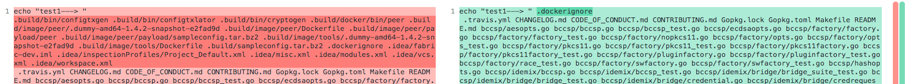

### Fabric No rule to make target(二)

最近，基于Fabric开发自己的分支，删除了Fabric官方的.git文件，并重新初始化了源代码，加入到了自己的私有仓库中，方便追踪管理第三方修改。实际上这些没必要，反而增加了工作量，带来了一个无法make的bug,本文解析此次Debug过程。


修改完Fabric代码后，直接在Fabric root下make相关内容，但是自从修改了版本控制，就出现了如下内容。
```bash
➜  fabric git:(master) ✗ ls
CHANGELOG.md       Gopkg.toml         bccsp              core               docs               gossip             integration        protos             scripts            token
CODE_OF_CONDUCT.md LICENSE            ci.properties      devenv             examples           gotools.mk         msp                release            settings.gradle    tox.ini
CONTRIBUTING.md    Makefile           cmd                discovery          go.mod             idemix             orderer            release_notes      test-pyramid.png   unit-test
Gopkg.lock         README.md          common             docker-env.mk      go.sum             images             peer               sampleconfig       testingInfo.rst    vendor
➜  fabric git:(master) ✗ make peer
make: *** No rule to make target `.build/bin/peer', needed by `peer'.  Stop.
➜  fabric git:(master) ✗ 
```
由于对Makefile不太熟悉，尤其是几个月前第一次写Makefile，shell变量和makefile变量之间的问题搞得头疼，就不想仔细看怎么回事。最后找到了一个临时办法，直接拿Fabric官方对应版本的make生成的中间文件用，这样因为有些文件已经存在，make就不会从头进行，避开异常的地方，见[Hyperledger Fabric make: *** No rule to make target问题](https://blog.csdn.net/scylhy/article/details/103569181)。


这次是是在没法了，因为有些中间文件不存在的导致一些编译无法进行，并且经常在make clean之后，需要重新复制中间文件。

鉴于昨天解决了一个有意思的bug,今天就想一举解决这个bug，好去锻炼。

---

启动make -d参数，看编译过程,停在了peer处，一般这种都是没有依赖导致的，所以看Makefile涉及Peer Target的内容,看是因为什么问题丢失了依赖文件。
```bash
root@node1:~/go/src/github.com/hyperledger/fabric-dev# make peer -d
GNU Make 4.1
Built for x86_64-pc-linux-gnu
Copyright (C) 1988-2014 Free Software Foundation, Inc.
License GPLv3+: GNU GPL version 3 or later <http://gnu.org/licenses/gpl.html>
This is free software: you are free to change and redistribute it.
There is NO WARRANTY, to the extent permitted by law.
Reading makefiles...
Reading makefile 'Makefile'...
Reading makefile 'docker-env.mk' (search path) (no ~ expansion)...
Reading makefile 'gotools.mk' (search path) (no ~ expansion)...
Updating makefiles....
 Considering target file 'gotools.mk'.
  Looking for an implicit rule for 'gotools.mk'.
...
   Looking for a rule with intermediate file '.build/image/peer/.dummy-amd64-1.4.2-snapshot-e2fad9d'.
    Avoiding implicit rule recursion.
    Trying pattern rule with stem '.dummy-amd64-1.4.2-snapshot-e2fad9d'.
    Trying implicit prerequisite '.build/image/peer/.dummy-amd64-1.4.2-snapshot-e2fad9d,v'.
    Trying pattern rule with stem '.dummy-amd64-1.4.2-snapshot-e2fad9d'.
    Trying implicit prerequisite '.build/image/peer/RCS/.dummy-amd64-1.4.2-snapshot-e2fad9d,v'.
    Trying pattern rule with stem '.dummy-amd64-1.4.2-snapshot-e2fad9d'.
    Trying implicit prerequisite '.build/image/peer/RCS/.dummy-amd64-1.4.2-snapshot-e2fad9d'.
    Trying pattern rule with stem '.dummy-amd64-1.4.2-snapshot-e2fad9d'.
    Trying implicit prerequisite '.build/image/peer/s..dummy-amd64-1.4.2-snapshot-e2fad9d'.
    Trying pattern rule with stem '.dummy-amd64-1.4.2-snapshot-e2fad9d'.
    Trying implicit prerequisite '.build/image/peer/SCCS/s..dummy-amd64-1.4.2-snapshot-e2fad9d'.
   No implicit rule found for '.build/bin/peer'.
   Finished prerequisites of target file '.build/bin/peer'.
  Must remake target '.build/bin/peer'.
make: *** No rule to make target '.build/bin/peer', needed by 'peer'.  Stop.

```

首先，diff本地Makefile和官方对应版本的Makeifle，确保Makefile没有被修改过。
```bash
➜  hyperledger cd fabric-dev
➜  fabric git:(56c6365) diff  Makefile ../fabric/Makefile
➜  fabric git:(56c6365) 
```

确实没改过，这样更麻烦，就需要看Makefile内容，看make peer之前的所有依赖命令。

```makefile
.PHONY: peer
peer: $(BUILD_DIR)/bin/peer
peer-docker: $(BUILD_DIR)/image/peer/$(DUMMY)
```
peer依赖\$(BUILD_DIR)/bin/peer
```makefile
$(BUILD_DIR)/bin/%: $(PROJECT_FILES) #这里%是通配符，包含上述的peer
	@mkdir -p $(@D)  #这里就在创建编译的输出路径
	@echo "$@"
	$(CGO_FLAGS) GOBIN=$(abspath $(@D)) go install -tags "$(GO_TAGS)" -ldflags "$(GO_LDFLAGS)" $(pkgmap.$(@F))
	@echo "Binary available as $@"
	@touch $@
```

\$(BUILD_DIR)/bin/peer包含在\$(BUILD_DIR)/bin/%中，并且依赖\$(PROJECT_FILES)

```makefile
# No sense rebuilding when non production code is changed
PROJECT_FILES = $(shell git ls-files  | grep -v ^test | grep -v ^unit-test | \
	grep -v ^.git | grep -v ^examples | grep -v ^devenv | grep -v .png$ | \
	grep -v ^LICENSE | grep -v ^vendor )
```
这里执行了git ls-files命令，检索了大量的文件，这些文件都是上述$(BUILD_DIR)/bin/peer的依赖。

到这里，依赖也就追溯到头了，接下来，分别测试是哪个阶段的问题，加入了test命令，测试各个解决段。
```makefile
test: $(PROJECT_FILES)
        @echo $(PROJECT_FILES)
```

测试 \$(PROJECT_FILES)，stop了
```bash
➜  fabric git:(master) ✗ make test
make: Circular .build/bin/configtxgen <- .build/bin/configtxgen dependency dropped.
make: Circular .build/bin/configtxlator <- .build/bin/configtxgen dependency dropped.
make: Circular .build/bin/configtxlator <- .build/bin/configtxlator dependency dropped.
make: Circular .build/bin/cryptogen <- .build/bin/configtxgen dependency dropped.
make: Circular .build/bin/cryptogen <- .build/bin/configtxlator dependency dropped.
make: Circular .build/bin/cryptogen <- .build/bin/cryptogen dependency dropped.
make: Circular .build/docker/bin/peer <- .build/bin/configtxgen dependency dropped.
make: Circular .build/docker/bin/peer <- .build/bin/configtxlator dependency dropped.
make: Circular .build/docker/bin/peer <- .build/bin/cryptogen dependency dropped.
make: Circular .build/docker/bin/peer <- .build/docker/bin/peer dependency dropped.
make: *** No rule to make target `.build/image/peer/.dummy-amd64-1.4.2-snapshot-e2fad9d', needed by `.build/docker/bin/peer'.  Stop.
➜  fabric git:(master) ✗ ls -a
```

又遇到了No rule to make targe!

对官方对应的版本测试一下，
```bash
➜  fabric git:(c6cc550cb) ✗ make test
make: Nothing to be done for `test'.
```
没问题！

输出一下，看看有什么不同


多余出来一堆.build/bind/*文件，赶紧去Fabric-dev根下看，没有啊，测试git ls-files，确实多出来了，这应该是把.build加到git记录中了。  
再看前边的make test输出,前后不都是.build下的吗？自己找自己？   
[dependency dropped. 就是告诉我们make过程中产生了循环依赖，并自动丢弃了。](https://blog.51cto.com/514254/569222)
但是最后被Stop的一条是非循环的，
最后被其中的一条触发了stop。

```bash
➜  fabric git:(master) ✗ make test
make: Circular .build/bin/configtxgen <- .build/bin/configtxgen dependency dropped.
make: Circular .build/bin/configtxlator <- .build/bin/configtxgen dependency dropped.
make: Circular .build/bin/configtxlator <- .build/bin/configtxlator dependency dropped.
make: Circular .build/bin/cryptogen <- .build/bin/configtxgen dependency dropped.
make: Circular .build/bin/cryptogen <- .build/bin/configtxlator dependency dropped.
make: Circular .build/bin/cryptogen <- .build/bin/cryptogen dependency dropped.
make: Circular .build/docker/bin/peer <- .build/bin/configtxgen dependency dropped.
make: Circular .build/docker/bin/peer <- .build/bin/configtxlator dependency dropped.
make: Circular .build/docker/bin/peer <- .build/bin/cryptogen dependency dropped.
make: Circular .build/docker/bin/peer <- .build/docker/bin/peer dependency dropped.
make: *** No rule to make target `.build/image/peer/.dummy-amd64-1.4.2-snapshot-e2fad9d', needed by `.build/docker/bin/peer'.  Stop.
➜  fabric git:(master) ✗ ls -a
```

<font color=red>**至此就知道该如何处理了，把误入到git files的.build清理掉，commit一下就可以（.gitignore中又.build内容）。**</font>

```bash
➜  fabric git:(05c47a0) ✗ git ls-files |grep ^.build
➜  fabric git:(05c47a0) ✗         #暂存区没有.build文件        
➜  fabric git:(05c47a0) make peer #编译成功
.build/bin/peer
CGO_CFLAGS=" " GOBIN=/Users/liu/work/go/src/github.com/hyperledger/fabric/.build/bin go install -tags "" -ldflags "-X github.com/hyperledger/fabric/common/metadata.Version=1.4.2 -X github.com/hyperledger/fabric/common/metadata.CommitSHA=05c47a0 -X github.com/hyperledger/fabric/common/metadata.BaseVersion=0.4.15 -X github.com/hyperledger/fabric/common/metadata.BaseDockerLabel=org.hyperledger.fabric -X github.com/hyperledger/fabric/common/metadata.DockerNamespace=hyperledger -X github.com/hyperledger/fabric/common/metadata.BaseDockerNamespace=hyperledger" github.com/hyperledger/fabric/peer
Binary available as .build/bin/peer
➜  fabric git:(05c47a0) ✗ .build/bin/peer 
Usage:
  peer [command]

Available Commands:
  chaincode   Operate a chaincode: install|instantiate|invoke|package|query|signpackage|upgrade|list.
  channel     Operate a channel: create|fetch|join|list|update|signconfigtx|getinfo.
  help        Help about any command
  logging     Logging configuration: getlevel|setlevel|getlogspec|setlogspec|revertlevels.
  node        Operate a peer node: start|status|reset|rollback.
  version     Print fabric peer version.

Flags:
  -h, --help   help for peer

Use "peer [command] --help" for more information about a command.
➜  fabric git:(05c47a0) ✗ 
```

---
回顾一下，这次bug用如下的demo就可以简单说明了。
```bash
➜  make cat Makefile
#test
$(shell echo test1 test2): test1
	@echo "$@"

test1: test3
	@echo "$@"
➜  make make test1
Makefile:6: warning: overriding commands for target `test1'
Makefile:3: warning: ignoring old commands for target `test1'
make: *** No rule to make target `test3', needed by `test1'.  Stop.
➜  make
```

---
Makefile  基本语法

```bash
.PHONY  peer  # 表示后续不产生peer，如果本地存在peer文件，则会忽略peer，仍执行；如果不设置.PHONY，则不会执行make peer命令，并输出“make: `peer' is up to date.”
GO_TAGS ?=  #   ?= 表示在未设置变量的时候，设置变量
$(patsubst <pattern>,<replacement>,<text> ) #替换函数

$(shell echo test1 test2): $(shell echo test3 test4)  #依赖前后都可以是多个
	@echo "$@"   #输出
test3:
test4:
test1: test2   #make test1可以通过，会告知存在循环依赖
	@echo "$@" #输出目标test1
```


[git ls-files命令查看暂存区中的文件信息](https://juejin.im/post/5cb98936f265da034c702454)


---
参考：

[make的常见错误信息](https://blog.51cto.com/514254/569222)   
[git ls-files命令查看暂存区中的文件信息](https://juejin.im/post/5cb98936f265da034c702454)

