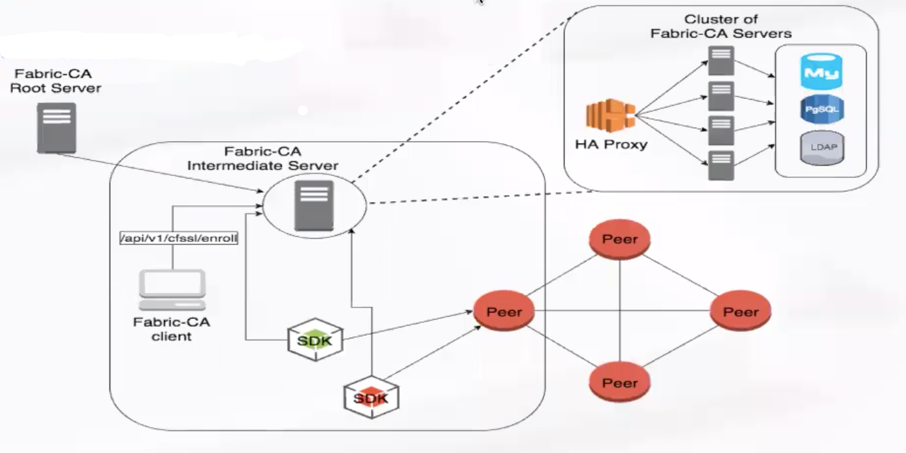
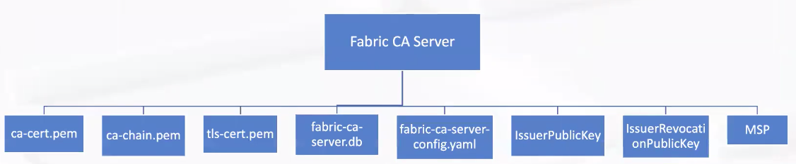
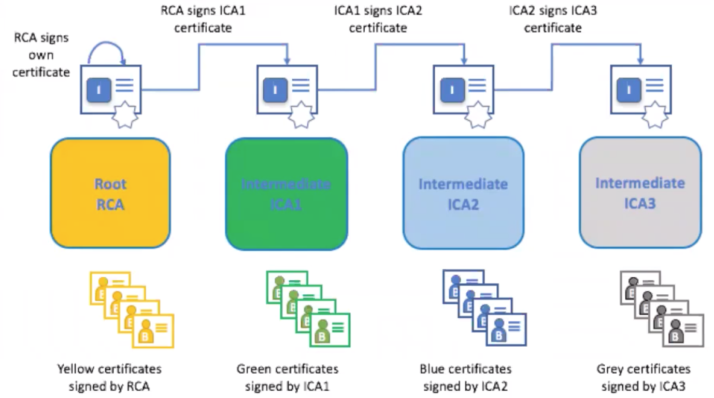
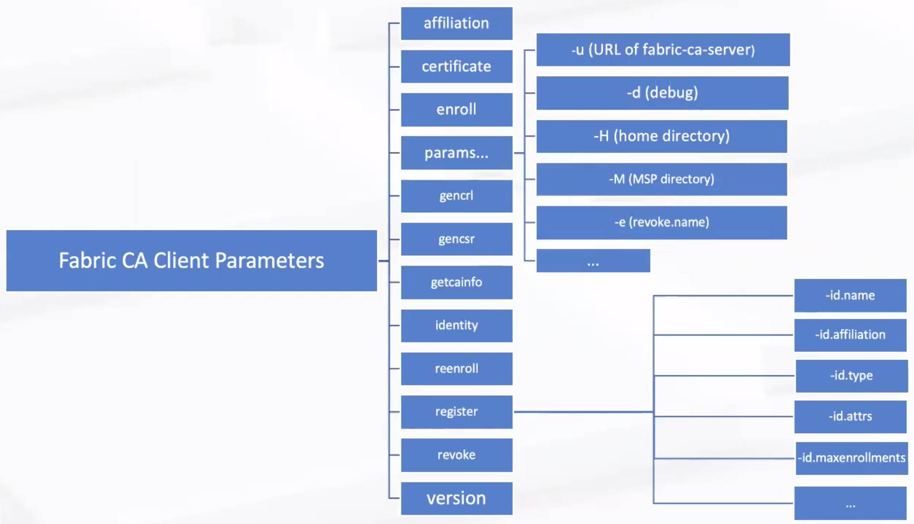
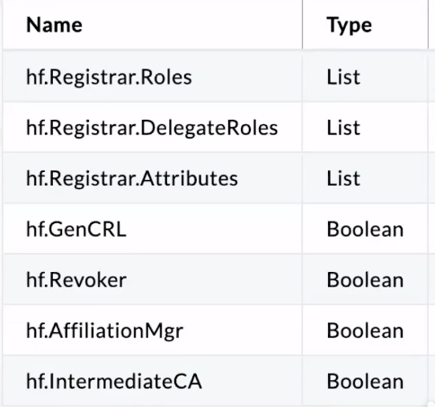
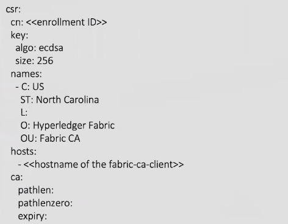
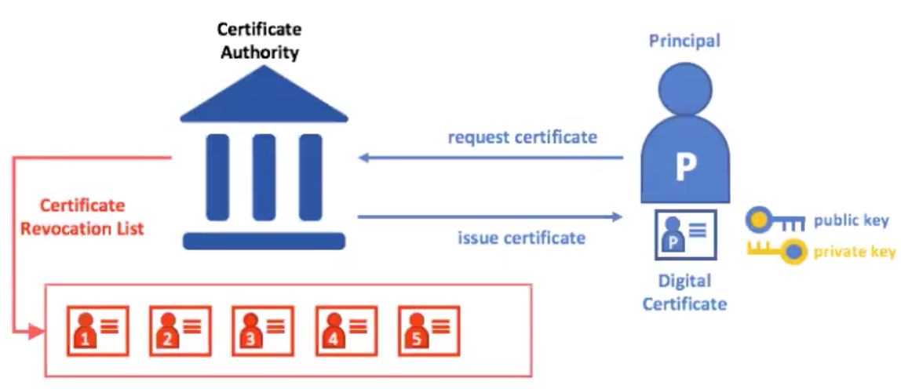
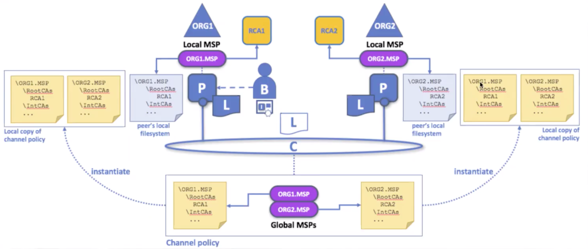
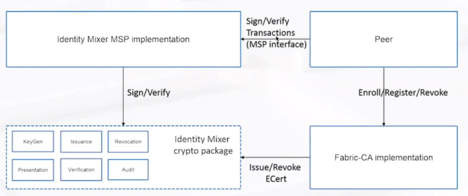
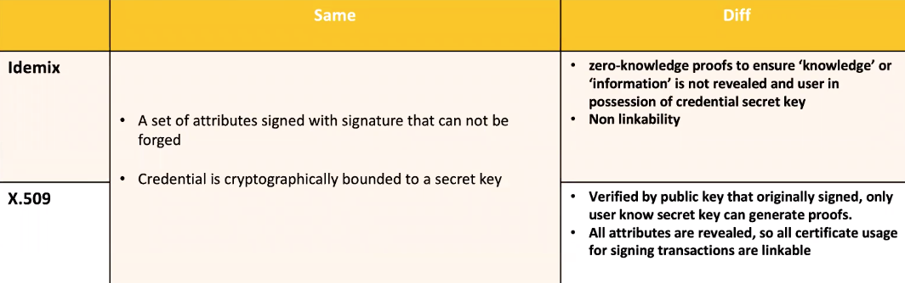

### Fabric MSP与CA  

Fabric CA Overview,PKI-X.500,MSP structure and uage,Identify Mixer,Hardware Security Module(HSM) and advantage  

Fabric CA:   
Feature: Registration of identities,Enrollment Certs,Certificate renewal and revocation   
C/S  
Architecture:  

Configture Settings:CLI flags,Environment vairables,Configuration file(优先级从高到低)

Fabric CA Servers Parameters:   
start,init,params(-b bootstrap identity,-n ca name,-u intermediate ca,-d debug,-H home directory,...),version  

Fabric CA Server Init:  
  
ca-cert.pem root证书  
ca-chain.pem intermediateCA所带的证书，证书链（第一级签发它的CA的root证书）   
tls-cert.pem tls证书...   
fabric-ca-server.db 默认sqliet db存储  
fabric-ca-server-config.yaml 配置文件，在init的时候默认生成，其中的参数可以通过command line设置   
issuerPublicKey、issuerRevocationPublicKey:用于identity mixer混合身份认证器      
MSP:fabric ca server msp  

Intermedia CA:  
Limit exposure of Root CA;   
Across multiple organizations;  
Enroll intermedia CA with Root CA;  
Certificate Chain trust between Root CA and a set of Intermediate CA;   

Fabric CA Client:   

fabric enroll是给identity生成msp的；  

ABAC(Attribute-Based Access Control)  

Access control decision can be made by chaincode  
Register with attribute-'id.attrs'  
Enroll with attributes-'enrollment.attrs'  
3 default attributes in Ecert:hf.EnrollmentID,hf.Type,hf.Affiiliation  
':ecert' to add attribute into Ecert  

   

CSR(certficate signing request)   
Provide to a Certification Authority(CA)   
X.509 certificates and keys(ECDSA)   

Identity lifecycle  

Register -> Modify -> Enroll -> ReEnroll -> Revoke  

fabric-ca-client register -d --id.name demouser --id.affiliation org1.department1 --id.type peer --maxenrollments -1 --id.attrs '"hf.Register.Roles=peer,user",hf.Revoker=true:ecert' -u <fabric-ca-server>:<port>  

fabirc-ca-client enroll -u https://abdaefa@<fabric-ca-server>:<port> -H <msp directory>  --caname <cn.name>   

Hyperledger Fabric SDKs (Node.js and Java) support:  
register a new user;  
enroll a user to obtain the enrollment certificate signed by the Fabric CA;   
revoke an existing user by enrollment ID or revoke a specific certificate;  
customizable persistence store;  

---

PKI-X.500(public key infrastructure)   

digital certificates;   
public and private keys;  
certificate authorities;  
certificate revocation list;   

X.509 certificates by Fabric CA  

Digital certificate is compliant with X.509 standard  

    X.509 cert content:  
    x.509 version;  
    certificate serial number;  
    signature algorithm(ecdsa-with-sha256);  
    issuer;   
    validate data;   
    subject;    
    subject public key info;  
    subject;  
    subject public key info;  
    public key;   

**MSP(membership service provider)**:  

certificate,organization,consortium(联盟),member   

features:  
abstracts all cryptographic mechanisms and protocols  
provide credentials to client and peers(client-authenticate transaction,peers-endorsements)  
1-N msp and MSP ID unique  
Fabric CA,OpenSSL,Cryptogen...   

MSP Verification(NSP identifier,Root CAs,Intermediate CAs,Admin CAs,OU list,CRLs)  

BCCSP  
blockchain cryptopraphic service provider  
implementation:PKCS#11(硬件),SW（默认）   

keystore是指存放路径...  
需要为每个peer、orderer、channels指定msp

valid identities of msp:  
x.509 certificates,verifiable certificate;  
not include in any crl;  
list one or more of OU of MSP configuration in their X.509 certificate structure  

msp tree  

root CAs,intermediate CAs,Organizational Units,Adminstrates,Revoked Certifaicates, Signing Certificates,Keystore[private keys],TLS Root CAs,TLS intremediate CAs  

Organization msp,为一个组织创建多个msp划分多个权限   

**MSP in Channel:**   

local msp:peer上的msp  
global msp:组成这个channel的msp的集合

  

**Identity Mixer(idemix)**  

Cryptographic protocol suite(privacy-preserving as anonymity,transact without revealing the identity of transactor,Unlinkability)  
Tree actors(User,issuer,verifier)  

idemix=X.509+cryptographic alogorithm   
Generate Zero-knowledger Proof  

  

Msp with identity mixer in fabric:  
issue idemix credentials in addition to X.509 certificate(issuerPublicKey,issuerRevocationPublicKey)  
Generate idemix credential(ou,isAdmin,Enrollment ID)  

idemix vs. X.509  

limitation of idemix  

fixed set of attributes(ou,role attribute,enrollment id,revocation handle attribute)  
revocation for idemix is not supported  
peers do not use idemix for endorsement  
recommended one idemix-based msp peer channel or per network as idemix currently provides only anonymity of clients among the same organiztion(msp)  

**Hardware Security Module(HSM) and advantage:**  

store private keys in an hsm via pkcs11 apis   
ibm hardware security module(FIPS 140-2 level 4,tamper-resistant tamper-evident,20000 ecc and 10000 rsa per second,lower latency)  
configured in the bccsp in fabric ca  

