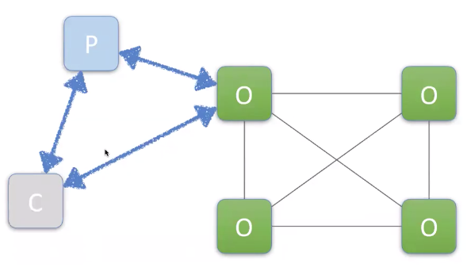
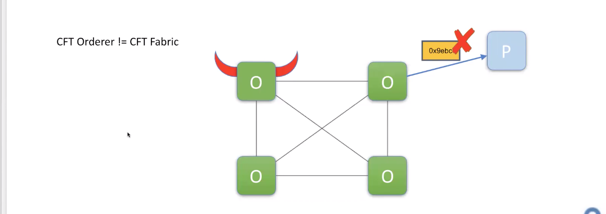
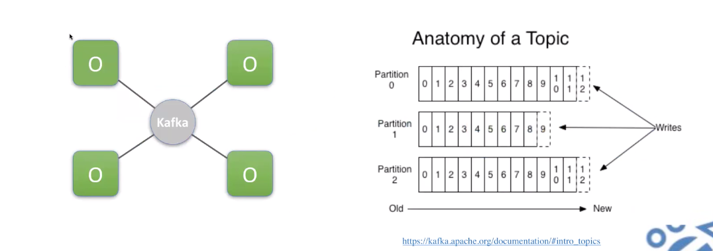
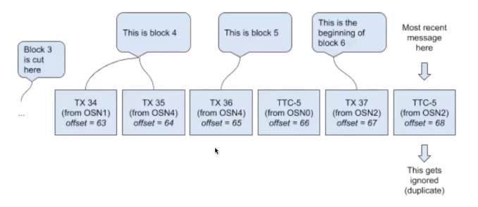
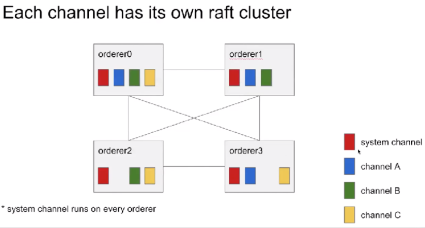
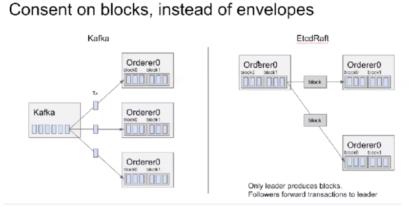
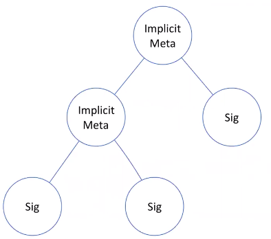
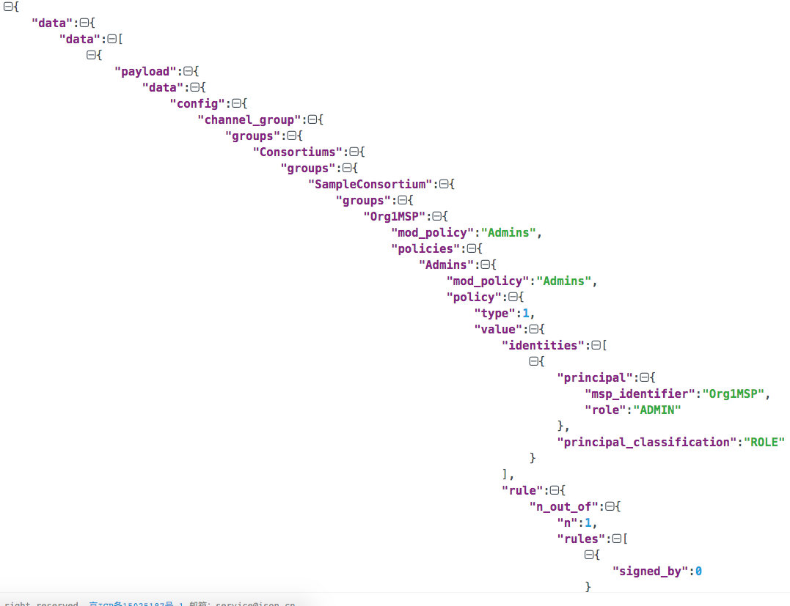

### IBM第五讲 Orderer解析

OUTLINE:   
Atomic Broadcast(Total Order)  
Channels  
Solo/Kafka/Raft   
Permission in Orderer   


#### Atomic Broadcast(Total Order):

Execute-Order-Validate共识模型     


**交易过程**：  

1. Client向Peer发送议案(proposal:A->B 20块钱)；   
2. Peer运行智能合约产生读写集，并返回客户端签过名的读写；   
3. Client讲proposal response打包发送给Orderer;     
4. Orderer会对所有收到的proposal进行排序，打包成区块，交给Peer;   
5. Peer打开区块，对区块中的proposal response进行验证(读写集的签名、版本号)，满足要求后，加入到本地账本，修改世界状态，最后想Client发送event,告知tx加入到账本。  




核心工作就在全排序：并不是所有的人都可以参与排序，有permission,orderer选择几家组织参与排序。  


**Orderer特性**：

1. Orderer产生的块都必须一致(块hash值一致):   
   Raft: 2f+1;bft:3f+1;  
2. 容错CFT（crash fault tolerance），当部分节点挂掉，Order服务仍能完成排序任务;  
3. 网络分区（Network Partition),需要自检测机制，探知分区；  
4. 强一致性（Strong Consistency,finality,no temporary fork):  
   PoX是最终一致性，概率一致，这也是为什么比特币要等几个区块之后才能确定一笔交易，这会导致多个链，使用最长链机制；Fabric不允许出现这种情况，当tx被提交后，是绝对不能被复写的。      
5. BFT问题，CFT Orderer!=CFT Fabric,防止恶意交易，拒绝请求等，虽然Orderer本身不是BFT，但这不表示Fabric是CFT:  
    1) 因为Fabric还有Peer去背书、验证的环节，所以说整个Fabric依然是BFT。但毕竟Orderer是CFT,所以有一些攻击是无法防范的，比如有恶意Orderer随意提交交易，这会导致Orderer拒绝出块，Client提交的交易不会被写入账本里（DoS攻击）。但是这种攻击在联盟链里是可探查的，比如查看其他Orderer的日志，可以诊断出某个Orderer在作恶。
    2) 虽然它对网络造成了影响，但是它不会造成数据的丢失、篡改，因为没有Peer的交易背书，是永远不会被提交的。
    3) 虽然Fabric能够防范的攻击类型较BFT少，但是作恶的严重程度是有限的。
    但在Peer处验证不过，这会影响Peer的打包出块服务（一种DDoS攻击）。正式因为在Peer处验证不过，所以无法做到账本数据篡改，也就是说Orderer虽然不是BFT,但带给Fabric的影响是有限的，出现类似攻击时，可以通过日志等手段定位解决。




**Block Cutting**:  

出块因素：
BatchSize:MaxMessageCount,AbsoluteMaxBytes,PreferredMaxBytes    
BatchTimeout:Timeout  

出块时机：
$$
F_{blockcut}(Timeout,MaxMessageCount,AbsoluteMaxBytes,PreferredMaxBytes) 
$$

块大小是可能大于PreferredMaxBytes的,比如PMB=200B,第一个tx=100B，第二个tx=200B，这时也会将第二个tx打包；  

疑问：AbsoluteMaxBytes,是用来限制单个交易大小的，超过AMB的tx会被拒绝（应该是IBM讲师的口误）

```yaml
 82     # Batch Timeout: The amount of time to wait before creating a batch
 83     BatchTimeout: 2s
 84 
 85     # Batch Size: Controls the number of messages batched into a block
 86     BatchSize:
 87 
 88         # Max Message Count: The maximum number of messages to permit in a batch
 89         MaxMessageCount: 10
 90 
 91         # Absolute Max Bytes: The absolute maximum number of bytes allowed for
 92         # the serialized messages in a batch.
 93         AbsoluteMaxBytes: 98 MB
 94 
 95         # Preferred Max Bytes: The preferred maximum number of bytes allowed for
 96         # the serialized messages in a batch. A message larger than the preferred
 97         # max bytes will result in a batch larger than preferred max bytes.
 98         PreferredMaxBytes: 512 KB
```


**Channels**:


1. 系统默认有一个System Channel,用来"管理"其他用户的链，但是“管理”这个词不太准确，因为创建链后，这些链是相互独立的,不会通过SC挺想User Channel；
2. Orderer启动，首先需要一个Genesis Block,这个GB规定了System Channel的所有配置，所有的Orderer都需要同样的Genesis Block来启动，GB相当于bootstrap,启动后，系统默认会有个System Channel;   
3. System Channel的作用就是创建新的用户链的时候，其实是启动了一个TX（包括要创建的链的名字及其他配置信息），这个TX会被提交到System Channel中，SC打开这个交易，发现这是一个创建用户Channel的交易，然后就会在Orderer中创建用户链，并把相关配置信息写入打包成用户Channel的Genesis Block，这样就创建完成一个用户链；  
4. jion Peer Channel操作就是把Genesis Block拿下来，送给Peer,让Peer知道去哪能找到对应的Orderer节点（GB中包含了Orderer的endpoints）,以及知道链中包含了哪些组织； 修改链的属性，比如修改BatchSize、添加组织，其实是想链发送了一个Config TX,Config TX不遵守普通的出块三要素限制，在共识提交后要尽快生效。    
5. System Channel和User Channel的实现上没有区别，同样可以提交Config TX；  


**Consensus**:solo、kfk、raft  


solo速度比较快，用于实验；  

kfk:

orderer之间没有直接连接，所有对TX的排序是依赖于kfk,做一个序列化的；  
kfk的一个partition中，是遵循FIFO的，多个w写入同一个partition,完成排序，r读取就是有序的tx了，kfk+zk完成了排序工作。  


问题是怎么从kfk划分的块是一致的？  
通过TTC（time to cut）消息划分TX的,Orderer直到拿到TTC，才会将之前的TX打包成块，从而保证所有的Orderer生成块一致。  



边界条件处理： 

读写kfk是异步，当提交了configTX，并从kfk返回了configtx, 提交应用了batchsize,但是之后接收到tx,可能不满足当前的config要求。这里通过config serialization进行的做了标号。

Raft:  

1. based ond etcd/raft library;  
2. No kfk/zk dependency(easier to operate),没有了外部的kfk/zk节点，运维kfk本身也是一个复杂的工作；  
3. Neccessary communication layer built for future use,kfk上osn之间是不互相通信的，但是引入raft后osn相互通信，这也是以后bft算法所需要的，相当于做了一个通讯层(p2p的)，之前没有p2p所以很难把一些算法加入进来；  
4. Each channel runs its own Raft instance,能够实现一个比较灵活的拓扑结构，之前所有的osn都在一个网络下，现在可以只把参与组织的osn加入进来，就不需要和其他的osn通信了，需要注意到是所有的osn都要在system channel中，否则不再sc的osn就无法加入uc获得gb参与共识；  
5. A channel can run on a subset of orderers;  
6. All orderers should belong to system channel;  
7. Nodes are identified by tls cert;
8. support migrating from kfk to raft;



区别：Consent on blocks, instead of envelopes:


raft leader先将txs打包成块，然后再把块发送给follower进行共识，最后存放到本地账本里，比特币、以太坊等也都是对块做共识的，之后fabric bft也是这个思路。

kfk一般不能跨data center;  


**Permission in Orderer**:  

ImplicitMeta Policy(树的中间节点):ANY,ALL,MAJORITY   
Signature Policy（叶子）:NOutoOf(AND,OR)  

通过以上两种Policy组合出丰富的规则  



解析gensis block:   

通过configtxgen 解析block
```bash
root@node1:~/go/src/github.com/hyperledger/fabric/examples/e2e_cli# ../../release/linux-amd64/bin/configtxgen --inspectBlock channel-artifacts/genesis.block  > output
2019-09-16 20:14:53.461 CST [common/tools/configtxgen] main -> INFO 001 Loading configuration
2019-09-16 20:14:53.490 CST [common/tools/configtxgen] doInspectBlock -> INFO 002 Inspecting block
2019-09-16 20:14:53.490 CST [common/tools/configtxgen] doInspectBlock -> INFO 003 Parsing genesis block
```
完整的block,输出有900多行，这里只贴部分
root@node1:~# cat output 
```json
 {
	"data": {
		"data": [
			{
				"payload": {
					"data": {
						"config": {
							"channel_group": {
								"groups": {
									"Consortiums": {
										"groups": {
											"SampleConsortium": {
												"groups": {
													"Org1MSP": {
														"mod_policy": "Admins",
														"policies": {
															"Admins": {
																"mod_policy": "Admins",
																"policy": {
																	"type": 1,
																	"value": {
																		"identities": [
																		...										
```



