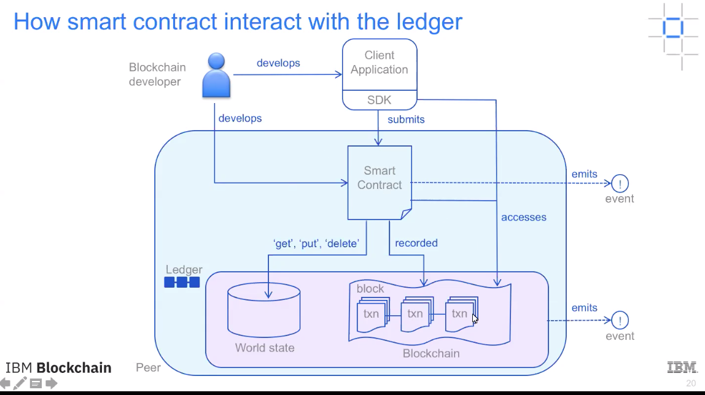
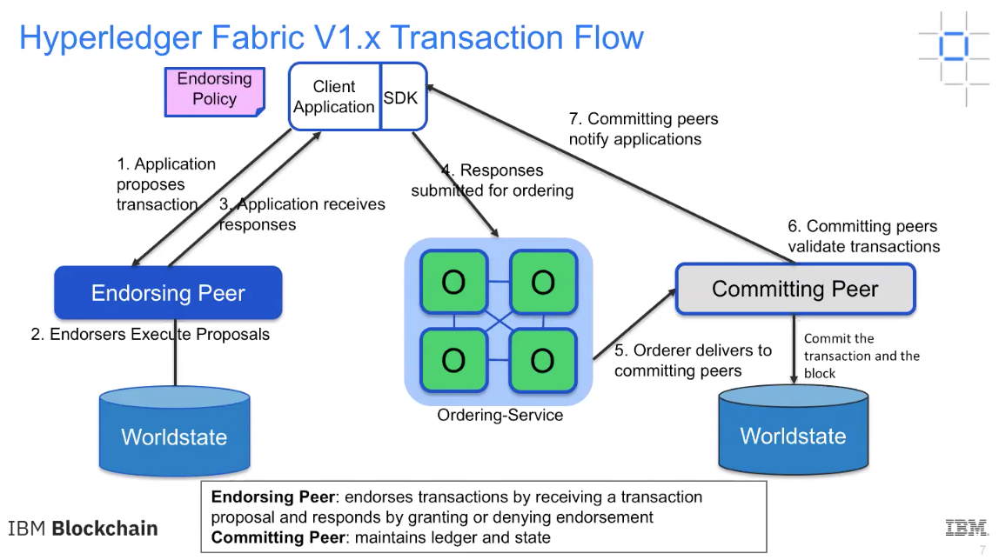
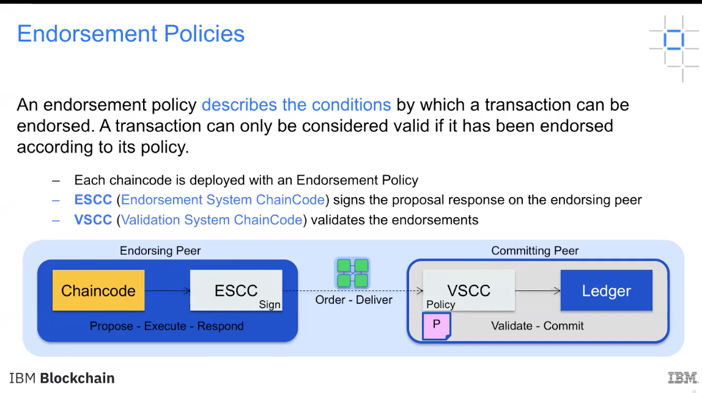
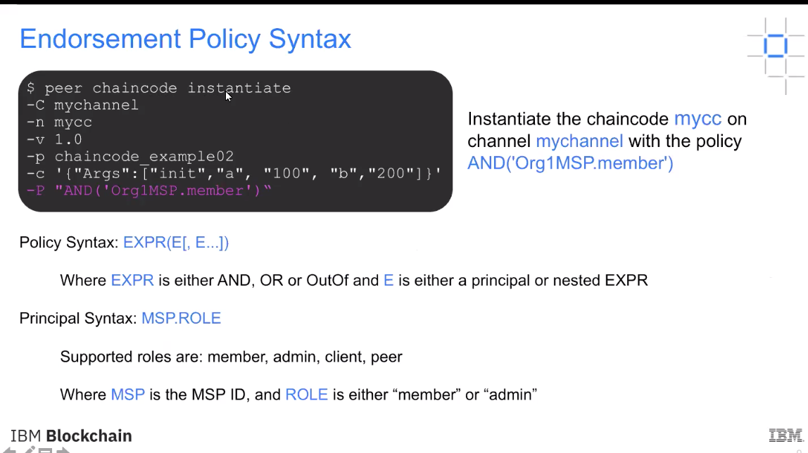
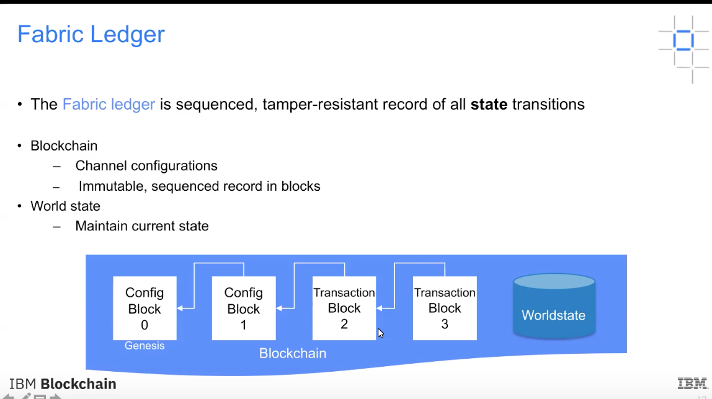
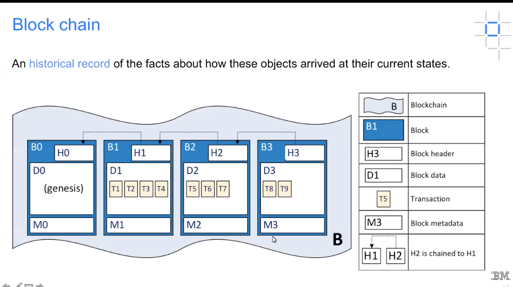
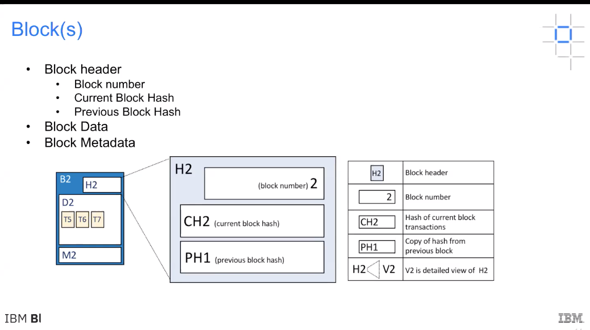
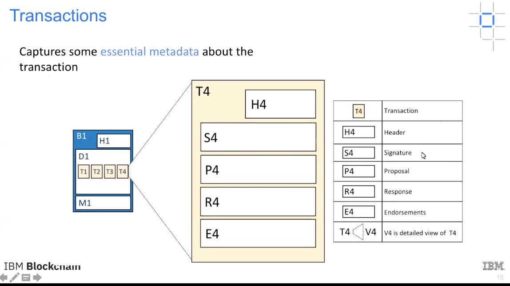
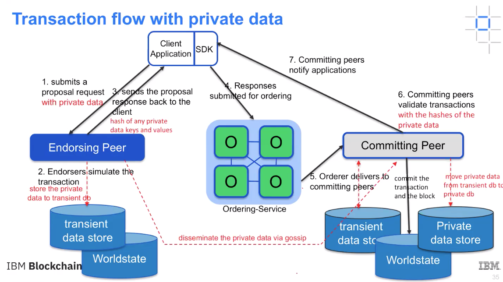

### Fabric Peer

Outline:   
Fabric Peer in Network Consensus   
Fabric Ledger and State DB   
Smart Contract in Fabric Network   
Gossip Protocol  
Private data to pretect privacy   
Sample Distributed network deployment



交易流程：



背书策略：  


在chaincode实例化时指定。  


eg:  
AND('Org1.member','Org2.member','Org3.member')  ;请求一个三方都同意的签名    
OR('Org1.member','Org2.member')  ;请求一个只要有一个同意的签名  
OR('Org1.member',AND('Org2.member','Org3.member')) ;请求org1同意或者org2和org3同时同意的签名  

账本和状态数据库：  



区块：  

Block header：Block number,Current Block Hash（Block Data中所有交易计算的hash）,Previous Block Hash  
Block Data:tx  
Block Metadata：写入的时间，写入的人，以及签名  



Transactions:  
Header:chaincode name、version;  
Singature:谁发的请求谁签名，client;  
Proposal:主要是一些input的参数；  
Response:智能合约执行的结果前后的数据；  
Endorsements:背书节点返回的结果（这里是个list，根据背书策略，返回多个peer的背书）  



Word State: 维护账本的当前信息，查询时直接从状态数据库中查找，而不用去区块查找


Smart Contract and Chaincode  

Chaincode Lifecycle:  
package install instantiate running  

upgrade running  


Packaging: 
- ChaincodeDeploymentSpec(CDS)-the source code,the name,and version of the chaincode  
- An instantiation policy,expressed as endorsement policies  
- A set of signatures by the entities that "own" the chaincode

peer chaincode package -n mycc -p github.com/hyperledger/fabric-samples/chaincode/abstore/go -v 1.0 -s -S -i "AND('Org1.admin')" ccpack.out  
peer chaincode signpackage ccpark.out singnedccpark.out  

Installing:  
必须把链码安装在所有的背书节点上   
peer chaincode install ccpark.out  

Instantiate chaincode:  
peer chaincode instantiate -n mycc -v 1.0 -c '{"Args":["a","100","b","200"]}' -P "AND {'Org1.member','Org2.member'}"  

Running and Upgrade


System Chaincode:  
LSCC(Lifecyce system chaincode)处理应用链码请求的声明周期  
CSCC(Configuration system chaincode)handles channel configuration on the peer side  
QSCC(Query system chaincode)provides ledger query APIs such as getting blocks and transactions  


Gossip Protocol  
管理peer发现和通道成员；  
允许

Leader peer:  
连接osn,拉去最新区块；
将交易发送给组织内其他提交节点；  
允许一个组织内有一个或者多个leader peers； 
Leader Peer election:Static and Dynamic;  

Anchor Peer:  
使用Gossip协议确保不同组织上的peers互相认知；  


Leader Election:  
Static:   
```yaml
peer: 
  gossip: useLeaderElection:false
  orgLeader: true
```

Dynamic: 
  peers执行leader选举程序去确定一个组织内的leader;  
  动态确定的leader会向组织内的其他peers发送心跳包；  

```yaml
  peer:  
    gossip: 
      useLeaderElection: true
      orgLeader: false  
      election:  
        leaderAliveThreshold: 10s
```

Gossip MSG:  
online peers indicate their availability by continually broadcasting "alive" msg;  
peers maintain channel membership by collecting these alive msg;  
peers receives/handle msgs,and forward the received msgs automatically as well;
each peer continually pulls blocks from other peers on the channel,in order to repair its own state if discrepancies are identified;   
peers on one channel cannot msg or share info on any other channel;  


Private Data:  
Confidential data that is stored in a private database on each authorized peer;  
Private data collection policy to define autorized peers;  
Ordering service does not see the private data; 
Sent peer-to-peer via gossip protocol;  

私有数据的交易流程：  
