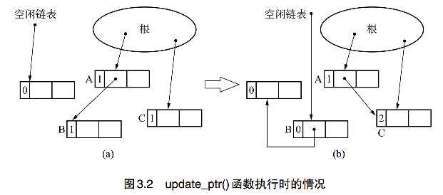

### 引用技术法

引用技术法（Reference Counting)在1960年被提出来，有GC本意“释放哪些无法被引用的对象”，人们很自然的想到，可以让所有对象先记录下“有多少程序引用自己”，这就是引用技术。

引用技术算法需要一个计数器，用来表示有多少程序引用了这个对象，引用技术法的对象的元数据中包含一个计数器。

引用技术法没有明确启动GC的语句。引用技术法于mutator的执行蜜鞋相关，它在mutator的处理过程中增减计数器来进行内存管理。技术器会在new_obj()和update_ptr()这两种情况下发生增减，接下来，我们一次看下这种情况。

mutator在生成新对象的时候会调用new_obj()函数，pickup_chunk是在free_list空闲链表上寻找一块size大小的空间，若有，则返回该块地址，并将计数器置为1，代表生成了新的对象，若没有，则返回NULL,表示分配失败。引用技术法不会想GC标记-清除还会有未清理的对象，可以通过清除整理出新的可用空间，但在引用技术法中，pickup_chunk()返回NULL，那就意味着堆中没有合适大小的分块了。
```cpp
new_obj(size){
    obj=pickup_chunk(size,$free_list)
    if(obj==NULL)
        allocation_fail()
    else
        obj.ref_cnt=1
        return obj
}
```

update_ptr()函数用于更新指针ptr,使其指向对象obj,同时进行计数器值的增减。增我明白，为什么减呢
在mutator更新指针是程序会执行该函数，但进行指针更新的只有第四行的*ptr=obj部分，而inc_ref_cnt()和dec_ref_cnt()是进行内存管理的代码，程序具体进行两想操作：
1. 对指针ptr新引用的对象（obj)的技术器进行增量操作
2. 对指针ptr之前引用的对象（*ptr)的计数器进行减量操作
inc_ref_cnt()函数比较简单它只是对新引用的对象obj的计数器进行增量操作，dec_ref_cnt则要对更新指针之前引用的对象*ptr的计数器进行减量操作。减量操作后，计数器的值为0的对象变成了“垃圾”，那么这个对象的指针会被全部删除，然后通过reclaim（）函数将obj连接到空闲连标上。

```cpp
update_ptr(ptr,obj){
    inc_ref_cnt(obj)
    dec_ref_cnt(*ptr)
    *ptr=obj
}
inc_ref_cnt(obj){
    obj.ref_cnt++
}
dec_ref_cnt(obj){
    obj.ref_cnt--
    if(obj.ref_cnt==0)
        for(child:children(obj))
            dec_ref_cnt(*child)
        reclaim(obj)
}
```
这里有个疑问为什么先调用inc_ref_cnt()函数，后调用dec_ref_cnt()函数？这是为了处理*ptr和obj是统一对象的问题，这时如果先执行dec_ref_cnf那么，*ptr的的计数器值就会变为0而被回收，这样再执行inc_ref_cnt()时，obj已经被回收了，可能会造成重大UBG。所以通过先增量，后减量，可以避免这个问题。

之前，一直有个疑问，为什么这个update_ptr()要对原指针进行减量操作，看到下边这张图，就明白许多了。



初始状态，A引用了B,之后要引用到C,这时就需要对原来指向的对象B进行减量操作，对C进行增量操作。从这张图我们就很容易明白update_ptr()是怎么回事，它是对一个指针从指向一个对象到指向另一个对象时的两个对象的引用指数的更新。除此情况就剩对象创建的情况，这不是用update_ptr()来管理的。
我们再看这张图，对B进行减量操作后，B的引用计数变为0，被连接到空闲变表实现了回收，而对象C因为增加了一个指针引用，其引用计数+1变为2。

在变更数组元素等的时候会进行指针的更新。通过更新指针，可能会产生没有被任何程序引用的垃圾对象。引用计数法中会监督在更新指针的时候是否有产生垃圾，从而在产生垃圾时将其立刻回收。也就是说，在分配时没有分块的情况下，队中所有的对象都为活动对象，这是没法新分配对象。可以说，将内存管理和mutator同时运行是引用计数法的一大特征。

我们再来看一下引用计数法的优缺点：
在优点上：
1. 可即可回收垃圾，在引用计数法中，每个对象始终都知道自己的被引用数，当引用数为0时，对象马上就把自己作为空闲空间连接到空闲链表上。也就是说，各个对象在编程垃圾的同时就会被立刻回收。
2. 最大暂停时间短，在引用计数法中，又痛mutator更新指针时程序才会执行垃圾回收，这大幅度消减了mutator的最大暂停时间。
3. 没有必要沿指针查找，当我们想减少沿指针查找的次数时，它就派上用场了。

在缺点上：
1. 计数器值的增减处理繁重，在大多数情况下指针都会频繁地更新，特别是有根的指针，每当指针更新时，计数器的值都会随之更新，因此值的增减处理必然会变得繁重。
2. 计数器需要占用很多位，用于引用计数的计数器最大必须能数完堆中所有对象的引用数。假如我们用32位机器，那么就有可能让2的32次方个对象同时引用一个对象，即我们必须确保各对象的计数器有32位。加入对象只有两个域，那么其计数器就占了它整体的1/3。
3. 实现繁琐复杂，引用计数的算法本身很简单，但事实上实现起来不容易，进行指针更新操作的update_ptr()函数是在mutator这边调用的，打个比方我们需要把以往的*ptr=obj的地方都重协程update_ptr(ptr,obj)。因为调用update_ptr()函数的地方非常多，所以重写过程中很容易出现遗漏。
4. 循环引用无法回收，当两个对象互相引用时，各计数器的值都是1，但是这组对象并没有被其他任何对象引用，因此，想一并回收这两个对象都不行，只要它们的计数器值都是1，就无法回收。

虽然有引用计数有个循环引用无法回收的致命弱点，但只要稍加改良，就会变得非常实用，有很多针对引用计数法的改良，这里不再介绍。

