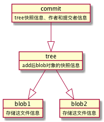
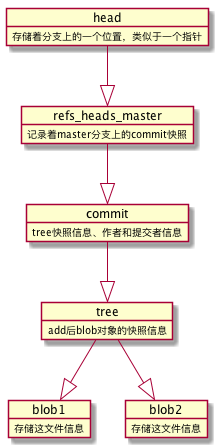

## Git原理  


了解git object如blob、tree、commit? 

三个命令的区别
```bash
git reset --soft 
git reset  
git reset --hard
```
```bash
git reflog
```

---

### Git是怎么存储信息的


**Git Object blob存储着文件的具体内容**
```bash
➜  learngit git init
Initialized empty Git repository in /Users/liu/work/test/learngit/.git/
➜  learngit echo "hello" >111
➜  learngit echo "world" >222
➜  learngit git add .
➜  learngit git:(master) ✗ tree .git
.git
├── HEAD
├── config
├── description
├── hooks
│   ├── applypatch-msg.sample
│   ├── commit-msg.sample
│   ├── fsmonitor-watchman.sample
│   ├── post-update.sample
│   ├── pre-applypatch.sample
│   ├── pre-commit.sample
│   ├── pre-push.sample
│   ├── pre-rebase.sample
│   ├── pre-receive.sample
│   ├── prepare-commit-msg.sample
│   └── update.sample
├── index
├── info
│   └── exclude
├── objects
│   ├── cc
│   │   └── 628ccd10742baea8241c5924df992b5c019f71
│   ├── ce
│   │   └── 013625030ba8dba906f756967f9e9ca394464a
│   ├── info
│   └── pack
└── refs
    ├── heads
    └── tags

10 directories, 18 files
➜  learngit git:(master) ✗ cat .git/objects/cc/628ccd10742baea8241c5924df992b5c019f71
xK��OR0c(�/�I�S(%                                                                                                                                                                                                                             ➜  learngit git:(master) ✗ git cat-file -t cc628
blob
➜  learngit git:(master) ✗ git cat-file -p cc628
world
➜  learngit git:(master) ✗
```
git cat-file [-t显示类型] [-p显示具体内容]   


```bash
➜  learngit git:(master) ✗ git commit -m "init"
[master (root-commit) cab31e4] init
 2 files changed, 2 insertions(+)
 create mode 100644 111
 create mode 100644 222
➜  learngit git:(master) tree .git/objects
.git/objects
├── 85   #新增文件 tree
│   └── 14940f380ac8fb2e13b122a6493950a67cf00b
├── ca   #新增文件 commit
│   └── b31e4ec4c6a46e9be1ee48649913d4e2d623c7
├── cc   #blob
│   └── 628ccd10742baea8241c5924df992b5c019f71
├── ce   #blob
│   └── 013625030ba8dba906f756967f9e9ca394464a
├── info
└── pack

6 directories, 4 files
➜  learngit git:(master) git cat-file -t 8514
tree
➜  learngit git:(master) git cat-file -p 8514
100644 blob ce013625030ba8dba906f756967f9e9ca394464a	111
100644 blob cc628ccd10742baea8241c5924df992b5c019f71	222
➜  learngit git:(master) git cat-file -t ce01
blob
➜  learngit git:(master) git cat-file -t cab3
commit
➜  learngit git:(master) git cat-file -p cab3
tree 8514940f380ac8fb2e13b122a6493950a67cf00b
author scylhy <scylhy@163.com> 1578033227 +0800
committer scylhy <scylhy@163.com> 1578033227 +0800

init
➜  learngit git:(master)
```
commit之后相当于对之前的add的文件打了一次快照存储在tree object中。通过存储的SHA1值就可以找到对应的blob对象。
```bash
100644 blob ce013625030ba8dba906f756967f9e9ca394464a	111
文件权限 类型 对应的SHA1值                                 文件名
```


commit对象存储这此次commit对应的快照信息。
```bash
➜  learngit git:(master) git cat-file -p cab3
tree 8514940f380ac8fb2e13b122a6493950a67cf00b      #此次提交的blob对象的快照
author scylhy <scylhy@163.com> 1578033227 +0800    #作者信息
committer scylhy <scylhy@163.com> 1578033227 +0800 #提交者信息

init                                               #提交的信息
➜  learngit git:(master)
```

commit、blob、tree三个对象的关系   



那分支和tag存储在哪里?  
```bash
➜  learngit git:(master) cat .git/HEAD
ref: refs/heads/master
➜  learngit git:(master) cat .git/refs/heads/master
cab31e4ec4c6a46e9be1ee48649913d4e2d623c7
➜  learngit git:(master)
```


HEAD、分支、普通的Tag可以简单的理解成是一个指针，指向对应commit的SHA1值。  





总结： 遇到三个object对象和一个refs对象

Git Object: blob（文件内容）、tree（目录结构、文件权限、文件名）、commit（上一个commit、对应快照、作者、提交信息）  
Git Refs: HEAD、分支、Tag   

Git Object是不可以变更的，refs类似于指针可以变更   


Q1:为什么要把文件的权限和文件名存储在Tree object里面而不是Blob object呢？  

分析文件内容和meta信息，不至于修改meta信息，也把文件内容保存一边，文件内容要比meta信息大的多。文件内容存在blob中，meta存储在tree中，修改相关内容，都要新建对应的对象存储。   


---


### Git的三个分区及变更历史的形成   

三个分区：工作目录、索引Index、git仓库  

工作目录：操作系统上，代码修改、变更都在这里    
索引-暂存区：git add后会把工作目录中的变更添加到索引中     
git仓库： git commit，把索引中的内容固化到仓库中    


创建文件111，此时只有工作区有变化   
git add 111，第一步：在git仓库中创建文件111的blob对象，第二步创建索引，并指向新建的blob对象   
git commit，第一步：将索引里的内容在git仓库中新建一个tree object,第二步：新建一个commit object,指向新建的tree object,第三步：更新master的head指针   


Git的大部分指令就是在操作这三个分区以及这条链。  


思考一下git的各种命令，尝试在上图将它们“可视化”出来


Q2: 每次commit，Git存储的是全新的文件快照还是存储文件的变更部分？  
全新的文件快照，取的时候处于O(1)的复杂度，如果是变更就会是O(N)的复杂度，需要把多有的内容叠加起来，另外git有gc,会把相似的文件压缩   


Q3: Git怎么保证历史记录不可篡改？   
Git和区块链的数据结构非常相似，两者都基于哈哈希树和分布式  

所有的记录是连接起来的，修改一个，后续就找不到了   


误操作导致分支部件了，如何恢复？   

不小心删除了分支，git reset --hard git rebase ...  

git reflog时光机，版本控制的版本控制，将分支的每一次的变更记录都存储起来  

如何过的一个干净的工作空间？现在的工作空间太乱了，工作到一半，临时插需求。   
不要用下边的命令,会将工作目录的文件删除掉
```bash
git reset --hard HEAD或者 git chekcout -f 
git clean -df
```
推荐使用，-u或者--include-untracked会把没有提交的加到git中  
```bash
git stash [-u] --include-untracekd
```
需要恢复时，再执行git stash pop就行了  


从Git历史中删除一个文件？涉及敏感信息（私钥、内网ip等）不需要版本控制的超大文件   

执行完后续命令后，添加到git仓库，但是整个链上哈希记录都会发生变化，需要提醒其他同学，否则合并的时候会非常头疼
```bash
git filter-branch --tree-filter 'rm -f password.txt' HEAD
```

上一次commit信息写错了，下边命令会让重新修改commit信息,要确保没有push到远端，否则会影响其他同学
```bash
git commit --amend
```


-i参数会出现一堆commit，可以整理一下commit消息
```bash
git rebase -i origin/master
```

看一下两个分支的区别
```bash
git show-branch
```

可以看每一行代码的变更
```bash
git blame
```

二分法，找到哪次出现的问题
```bash
git bisect
```

参考：

[这才是真正的Git，Git原理及应用技巧](https://www.lzane.com/slide/git-under-the-hood/index.html#/)   
[图解Git](https://marklodato.github.io/visual-git-guide/index-zh-cn.html)