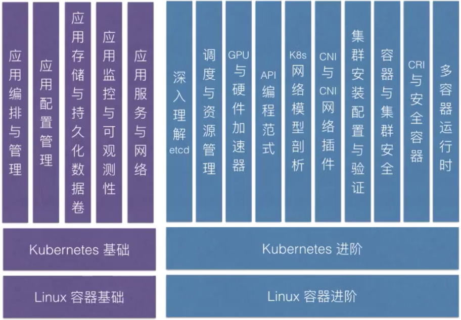

### 第一堂云原生课  

云原生技术发展历程（为什么要学习这门课）  
课程简介与预备知识（这门课到底教什么）  
云原生的定义与技术要点（本节正式内容）   

---

2004-2007，Google大规模使用容器（cgroups)技术；   
2008.1 cgroups合并入linux内核主干；  
2013.03 Docker项目正式发布；   
2014。06 kubernetes项目发布，主要用来管理海量的Docker容器（k8s发布的初衷）;   
2015.07 CNCF成立，22个创始会员，k8s成为CNCF的第一个项目   
...

云原生基金会|云原生技术社区|云原生技术产业   

2013年，Docker项目发布：使的全操作系统语义的沙河技术唾手可得（使用户可以更好的打包自己的应用），对传统PaaS产业“降维打击”，是开发者有了最小的可运行单位  
2014年，Kubernetes项目发布：Google Borg/Omega系统思想借助开源社区“重生”，“容器设计模式”的思想正式确立。为什么选择开源？Borg/Omega系统太过于复杂，无法直接给外部使用   
2015-2016年，容器编排“三国争霸“：Docker Swarm,Messos,Kubernetes在容器编排领域展开角逐。为什么要竞争？各自优势为何？  
2017年，Kubernetes项目事实标准确立：Docker公式宣布在核心产品内置Kubernetes服务，Swarm项目逐渐停止维护。原因为何？Swarm偏生态，Mesos技术更强，k8s兼顾二者   
2018年，云原生技术理念逐步萌芽，Kubernetes和容器成为所有云厂商上的既定标准，以“云”为核心的软件研发思想逐步形成   
2019？  

2019年-云原生技术普及元年  

阿里巴巴集团“全面上云“；  
以”云“为核心的软件研发思想，逐步成为默认选项；   
k8s等云原生技能成为技术人员必修课，大量工作岗位涌现；   
“会k8s“已经远远不够，“懂k8s"、"会与原生架构“的重要性日益凸显。  

大纲：

---
什么是“云原生”？云原生该怎么落地？  

云原生的定义：  

云原生，是一条最佳路径，是一条能够使用户能：
1. 低心智负担的  
2. 敏捷的   
3. 以可扩展、可复制的方式，  
最大化的利用“云”的能力、发挥“云”的价值的最佳路径  

云原生的愿景：  
软件从诞生起就生在云上、长在云上的、全新的软件开发、发布和运维模式  

思考：集装箱（容器技术）为什么具有革命性？  
容器技术是我们的应用能够有一种完整的自包含的定义方式，所以我们的应用才能够敏捷的、可扩展、可复制的方式发布在云上，发挥出云的能力。这也说明了为什么容器技术是云原生的基础。  

云原生的技术范畴：  

云应用定义与开发流程：
1. 应用定义与镜像制作
2. CI/CD 
3. 消息和Streaming  
4. 数据库  

云应用编排与管理：
1. 应用编排与调度
2. 服务发现与治理  
3. 远程调用
4. API网关
5. Service Mesh

监控与可观测行：
1. 监控
2. 日志
3. Tracing
4. 混沌工程

云原生底层技术：
1. 容器运行时
2. 云原生存储技术
3. 云原生网络技术

云原声工具集：
1. 流程自动化与配置管理
2. 容器镜像仓库
3. 云原生安全技术
4. 云端密码管理 

Serverless:PaaS的极端形态
1. FaaS
2. BaaS
3. Serverless计费

**云原生思想的两个理论基础**：   
1. 不可变基础设施：目前实现，容器镜像   
2. 云应用编排理论：目前实现，容器设计模式  

**基础设施向云演进的过程：自建基础设施 -> 云的价值** ：

传统的应用基础设施：可变，比如ssh连到服务器，手动升级或降级软件包，诸葛服务器地调整配置文件，以及将新代码直接部署到现有服务器上。  
基础设施是独一无二的宠物，要细心呵护

对云友好的应用基础设施：不可变，比如部署完成之后基础设施不会被修改。如需更新，则先更改的公共镜像构建新服务以替代旧服务。经过验证后，新服务投入使用，旧服务则退役。  
基础设施是可以体态的牲口，随时替换（这是因为我们有了自包含的容器）。   

**基础设施向云演进的意义**:  
基础设施一致性和可靠性：容器镜像（对于用户来说并不关心容器运行在什么机器上，用户来看都是容器内部的os）;自包含(包含应用所需要的所有依赖);可漂移（也正是因为自包含，所以可以漂移到云上的任何一个位置）    
简单可预测的部署与运维：自描述，自运维（利用k8s operator技术做成自运维的）；流程自动化，容易水平扩展，可快速复制的管控系统与支撑组件（不可变基础设施的特点） 

**云原生关键技术点**：   
自包含、可定制的应用镜像；  
应用快速部署与隔离能力；   
应用基础设施创建和销毁的自动化管理；   
可复制的管控系统与支撑组件  

总结：  
云原生具备重要的意义，它是云时代技术人自我提升的必备路径；  
云原生定义了一条云时代应用从开发到交付的最佳路径  

知识点自测：  
1. 哪个项目跟k8s的功能重合度最高？Docker Swarm模式（SwarmKit);   
2. 我编写的容器化应用，会讲日志文件写在某路径写死的目录里。请问这破坏了云原生理念了吗？是  
3. 容器启动后，我会时常ssh进入到容器然后写很多文件。请问这破坏了云原生理念了吗？是  
4. k8s并不支持为应用固定ip,于是我自己通过编写网络插件把应用ip管理在了etcd里，然后上线，请问这破坏了云原生的理念了吗？是  
5. 以下哪些标准，可以用来考察一个应用架构是否是云原生的？（应用实例能否快速水平扩展+；应用是否使用静心啊个机制打包来保证韩晶一致性+；应用数据是否都写在容器数据卷中+；应用是否有状态-）

