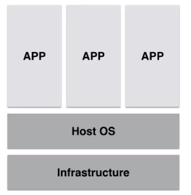
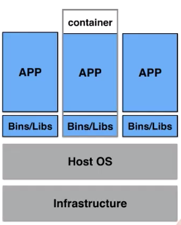
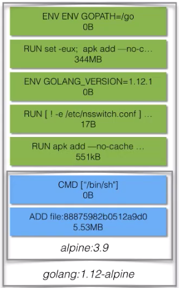
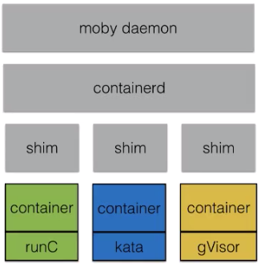
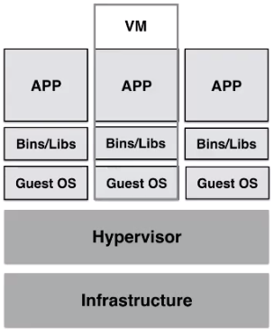
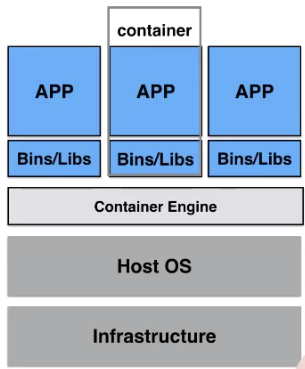

### 容器基本概念

大纲：容器与镜像；容器生命周期；容器项目的架构；容器vsVM;课后实践  


**什么是容器？**  


进程可见、可相互通信；  
共享同一份文件系统：   



资源视图隔离-namespace  
控制资源使用率-cgroup  
独立的文件系统-chroot  



容器，是一个视图隔离、资源可限制、独立文件系统的进程集合。  
视图隔离—如能看见部分进程；独立主机名等等  
控制资源使用率-如2G内存大小；cpu使用个数等等  


什么是镜像？  
运行容器所需要的所有文件集合-容器镜像   
Dockerfile-描述镜像构建步骤  

构建步骤所产生出文件系统的变化-changeset（分层和复用）:  
类似disk snapshot;  
提高分发效率，减少磁盘压力;  


如何构建镜像？  

编写Dockerfile app:v1,docker build . -t app:v1
```Dockerfile
FROM golang:1.12-alpine
WORKDIR /go/src/app
COPY . .
RUN go get -d -v ./... #获取依赖
RUN go install -v ./... #构建，并安装到可检索目录
CMD ["app"] #默认名字
```

docker registry - 镜像数据的存储和分发  
docker push app:v1


如何运行容器？  

从docker registry下载镜像，docker pull busybox:1.25  
查看本地镜像列表，docker images  
选择相应的镜像并运行，docker run [-d] --name demo busybox:1.25 top  


小节：  
容器-和系统其他部分隔离开的进程集合  
镜像-容器所需要的所有文件集合，Build Once,Run anywhere  

---
**容器运行时的生命周期**

单进程模型：   
init进程生命周期=容器生命周期  
运行期间可运行exec执行运维操作  

数据持久化：  
独立于容器的生命周期；  
数据卷-docker volume vs bind   


```bash
#bind host dir into container
docker run -v /tmp:/tmp busybox:1.25 sh -c "date >/tmp/demo.log"

#check result
cat /tmp/demo.log 
Tue Apr 9 02:17:55 UTC 2019  

#let it handled by docker container engine  
docker create volume demo 

#demo is vlume name
docker run -v demo:/tmp busybox:1.25 sh -c "date > /tmp/demo.log"  

#check result
docker run -v demo:/tmp busybox:1.25 sh -c "cat /tmp/demo.log"
Tue Apr 9 02:19:57 UTC 2019
```

---
容器项目架构

moby容器引擎架构：  


containerd:
容器运行时管理引擎，独立于moby daemon;   
containerd-shim管理容器生命周期，可被containerd动态接管  


容器运行时：  
容器虚拟化技术方案  
runC kata gVisor 




---

容器和VM之间的差异

vm:  
模拟硬件资源，需要Guest OS  
应用拥有Guest OS所有资源  
更好地隔离效果-Hypervisor需要消耗更多的资源  



container:   
无Guest OS，进程级别的隔离  
启动时间更快  
隔离消耗资源少-隔离效果弱于VM


---
预告：  
容器镜像的本质  
深入了解容器隔离（namespace)和资源控制（cgroup)  
容器数据卷的实现方式  
containerd架构分析和工作原理解析  


自测：  

1. 已经运行docker run -d -t --name demo ubuntu top命令，以下哪个docker命令创建出的容器看见demo容器进程？  
docker run --name demo-x --pid container:demo ubuntu ps  

2. 已知容器Init进程PID，在宿主机上通过kill -9 PID的方式结束该进程，容器当前的状态是什么？Exited

3. 已运行docker run -d -t --name demo ubuntu top和docker run --name demo-x --pid container:demo ubuntu ps命令，如果demo容器退出了，正在运行的demo-x容器是否退出？是  

4. 以下哪个docker命令可以用来创建一个使用宿主机主机名的容器？  
docker run --uts=host ubuntu hostname  

5. 已运行docker run -d --name demo busybox:1.25 top命令，如何使用docker命令来获取容器demo的Init进程PID?  
docker inspect demo -f '{{.State.Pid}}'  

6. 已运行docker run -d -t --name demo ubuntu top和docker run --name demo-x --pid container:demo ubuntu ps 命令，是否可以在demo-x容器内部停止容器？是  

7. 已运行docker run -d -t --name demo ubuntu top命令，是否可以在demo这个容器内部停止容器？否 

8. 已运行docker run -d -t --name demo ubuntu top命令，在demo这个容器看到top命令的Pid是什么？ 1

9. 以下哪个Docker命令创建出来的容器可以自动重启？  
docker run --restart always busybox top X,前台docker退出就关闭了  
docker run -d --restart always busybox top  

10. 如何快速判断docker daemon是否支持动态接管运行容器？  

    docker info |grep "Live Restore Enabled"  
    docker info -f "{{.LiveRestoreEnabled}}"