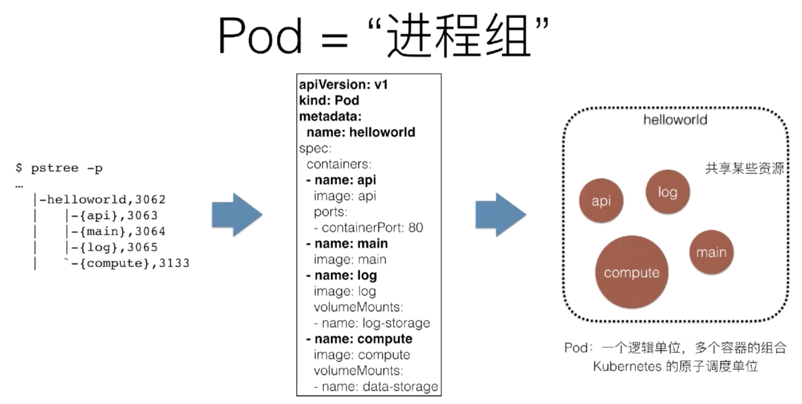
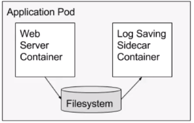
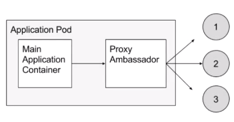
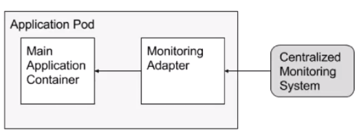

 ### 理解 Pod 和容器设计模式

 大纲：为什么需要pod?Pod的实现机制，详解容器设计模式   

 ---

 **为什么需要pod**

 容器的本质？   
 一个视图被隔离、资源受限的进程：容器里PID=1的进程就是应用本身；管理虚拟机=管理基础设施，管理容器=直接管理应用本身  

 那么k8s呢？  
 k8s就是云时代的操作系统：一次类推，容器镜像其实就是:这个操作系统的软件安装包  


 看一个操作系统里的例子  
 eg:helloworld程序：helloword程序实际上是由一组进程(Linux线程)组成；这4个进程共享helloword程序的资源，相互协作，完成helloworld程序的工作（可用pstree查看）

 思考？k8s=os,容器=进程，Pod=?  
 类比Pod为进程组  

 helloworld程序有4个进程组成，这些进程之间共享某些文件，问题：helloworld程序如何用容器跑起来呢？  

 方法1: 在一个Docker容器中，启动这4个进程 

 疑问：容器PID=1的进程就是应用本身比如main进程，那么谁来负责管理剩余的3个进程？

 容器是“单进程”模型,容器中如果有多个进程，那么只有一个进程可以作为pid=1的进程，如果pid=1的进程挂了，那么其他进程就会成为孤儿，没有人能够回收它们资源  

 除非：   
 应用程序本身具备进程管理能力（意味着helloworld程序需要具备systemd的能力）;  
 或者容器的PID=1进程改成systemd —> 这会导致：管理容器=管理systemd!=直接管理应用本身，没办法直接管理应用了，应用状态的生命周期就不等于容器的生命周期，这个模型非常复杂  

 Pod=进程组:  
 k8s会把一组进程分别以容器的方式启动在Pod中，pod只是一个逻辑单位，真正运行的是容器，pod是容器分配资源的单位，pod的容器内共享资源的。  
 
 Google工程师们发现，在Borg项目部署的应用，往往都存在这类似于“进程和进程组“的关系。更具体的说，就是这些应用之间有着密切的协作关系，使得它们必须部署在同一台机器上并且共享某些信心。   


 为什么Pod必须是原子调度单位？   

 举例：两个容器紧密协作  

 类别|APP|LogCollector
 ---|---|---
 内存要求|1G | 0.5G 

 节点|NodeA|NodeB
 ---|---|---
 当前可用内存|1.25G|2G  

 如果App先被调度了NodeA上，会怎么样？  
 Task co-scheduling问题（成组调度失败）：
 Messos:资源囤积（resource hoarding):所有设置了Affinity约束的任务都达到时，才开始统一进行调度；调度效率损失和死锁  

 Google Omega:乐观调度处理冲突：先不管这些冲突，而是通过精心设计回滚机制在出现了冲突之后解决问题；复杂  

 k8s:直接通过一个Pod概念解决了  

 再次理解Pod  

 亲密关系-调度解决：两个应用需要运行在同一台宿主机上,可以通过调度器解决

 超亲密关系-Pod解决: 会发生直接的文件交换; 使用localhost或者socket文件进行本地通信; 会发生非常频繁的rpc调用；会共享某些linux namespace (比如，一个容器要加入另一个容器的Network ns)

---
**Pod的实现机制**

Pod要解决的问题：如何让一个Pod里的多个容器之间最高效的共享某些资源和数据？容器之间原本是被linux Namespace和cgroups隔离开的   

第一部分：共享网络  

**容器A和容器B共享网络**:  
通过Infra Container的方式共享通一个Network Namespace，join方式加入 :镜像k8s.grc.io/pause,会变语言写的、永远处于“暂停”，大小100-200kb;   
直接使用localhost进行通信；   
看到的网络设备跟infra容器看到的完全一样；   
一个pod只有一个地址，也就是这个pod的Network Namespace对应的IP地址：所有网络资源，都是一个pod一份，并且被该Pod中的所有容器共享；  
整个pod的生命周期跟infra容器一致，而与容器A和B无关   

第二部分：共享存储  

shared-data对应在宿主机上的目录会被同时绑定挂载进了上述两个容器中   

```yaml
apiVersion: v1
kind: pod 
metadata: 
  name: two-containers
spec: 
  restartPolicy: Nerver
  volumes: 
  - name: shard-data
    hostPath:
      path: /data
  containers: 
  - name: nginx-container
    image: nginx
    volumeMounts: 
    - name: shard-data
      mountPath:  /usr/share/nginx/html
  - name: debian-container
    image: debian
    volumeMounts:
    - name: shard-data 
      mountPath: /pod-data
    command: ["/bin/sh"]
    args: ["-c","echo hello from the debian container > /pod-data/index.html"]
```

---
**详解容器设计模式**

举例：war包+tomcat的容器化  

方法一：把war包和tomcat打包进一个镜像，无论是war包和tomcat更新都需要重新制作镜像  
方法二：镜像里只打包tomcat。使用数据卷（hostpath)从宿主机上将war包挂载进tomcat容器，需要维护一套分布式存储系统

有没有更通用的方法？  

InitContainer

Init Container 会比spec.containers定义的用户容器先启动，并且严格按照定义顺序依次执行；   
/app 是一个Volume   
Tomcat容器，同样声明了挂载该Volume到自己的webapps目录下  
故当Tomcat容器启动时，它的webapps目录下就一定会存在sample.war文件  


```yaml
apiVersion: v1
kind: Pod
metadata:  
  name: javaweb-2
spec: 
  initContainers:
  - image: resouer/sample:v2
    name: var
    command: ["cp","/sample.war","/app"]
    volumeMounts:
    - mountPaht: /app
      name: app-volume
  containers:
  - image: resouer/tomcat:7.0
    name: tomcat
    command: ["sh","-c","/root/apache-tomcat-7.0.42-v2/bin/start.sh"]
    volumeMounts:
    - mountPath: /root/apache-tomcat-7.0.42-v2/webapps
      name: app-volume
    ports:
    - containerPort: 8080
      hostPort:8001
  volumes:
  - name: app-volume
    emptyDir: {}
```

**容器设计模式： SideCar**：  

通过在pod里定义专门容器，来执行主业务容器需要的辅助工作，比如:原本需要ssh进去执行的脚本;日志手机;Debug应用;应用监控,优势：将辅助功能通主业务容器解耦，实现独立发布和能力重用  


SideCar: 应用日志与收集   

业务容器将日志写在Volume里；  
日志容器共享该Volume从而将日志转发到远程存储当中(Fluentd等)   




SideCar: 代理容器  

pod需要使用外部集群服务，但是希望只使用一个ip就可以，有一种方法就是使用容器代理，这样不用修改业务代码，业务容器直接通过localhost访问代理容器就可以

代理容器对业务容器屏蔽被代理的服务集群，简化业务代码的实现逻辑   

提示：容器之间通过localhost直接通信；代理容器的代码可以被全公司重用   


SideCar: 适配器容器  


适配器容器将业务容器暴露出来的接口转化为另一种格式  

举例：  
业务容器暴露出来的监控接口是/metrics;   
Monitoring Adapter将其转换为/healthz以适配新的监控系统；   
提示：容器之间通过localhost直接通信；代理容器的代码可以被全公司重用  



本节总结：  

Pod是K8S里实现“容器设计模式”的核心机制；   
“容器设计模式”是Google Borg的大规模容器集群管理最佳实践之一，也是k8s进程复杂应用编排的基础依赖之一；   
所有设计模式的本质都是：解耦和复用   

