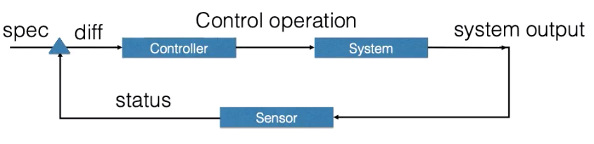
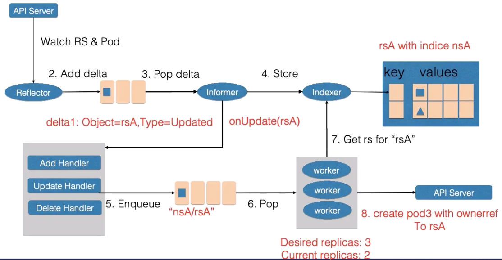
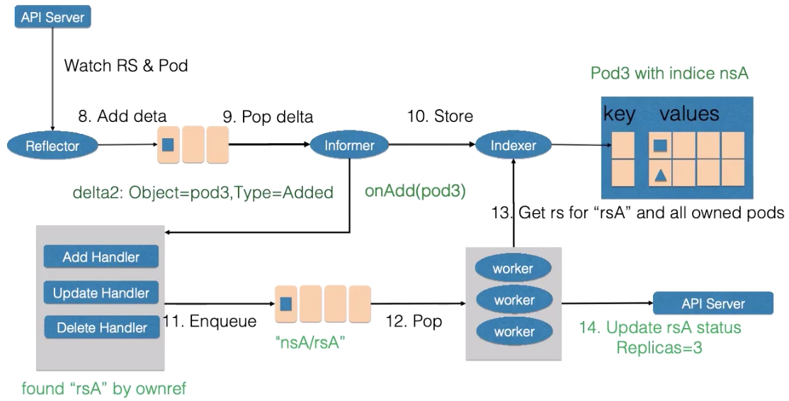
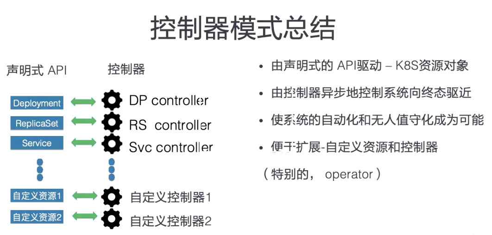

### 应用编排与管理：核心原理   

大纲：资源元信息、操作演示、控制器模式、总结  


k8s资源对象   

spec: 期望的状态  
status: 观测到的状态  
metadata: Labels,Annotations,OwnerReference   


Labels:  

标识型的key: value元数据  
作用：用于筛选资源；唯一的组合资源的方案  
可以使用selector来查询：类似于sql 'select * where ...'  

例子：  
```yaml
enviroment: production 
release: stable  
app.kubernetes.io/version: 5.7.21  
failuer-domain.beta.kubernetes.io/region: ch-hangzhou   
```


Selector  

相等型Selector: Tie=front,Env=dev  : 选中app1   
集合型Selector: Env in(test,gray)  : 选中app3,app4   
其他集合Selector例子： tie notin (front,back) ：未选中   
其他集合Selector例子： release ：选择带有release标签的pod，未选中   
其他集合Selector例子： !release ：选中app1,app2,app3,app4   


app1: Tie:front Env:dev  
app2: Tie:back Env:prod    
app3: Tie:front Env:test   
app4: Tie:back Env:gray


**annotaions**  

一般是系统或工具用来存储资源的非标识性信息，可以用来扩展资源的spec和status描述

key:value   
作用：存储资源的非标识性信息；扩展资源的spec/status  
特点：一般比label更大；可以包含特殊字符，可以结构化也可以非结构化   

例子：
```yaml
service.beta.kubernetes.io/alicound-loadbalancer-cert-id: your-cert-id  
nginx.ingress.kubernetes.io/service-weight: "new-gnix:20,old-nginx:60" 
kubectl.kubernetes.io/last-applied-configuration: {"apiVersion":"apps/v1","kind":"Deployment",....}
```


Ownereference  

所有者即集合类资源： Pod的集合(replicaset,statefulset)   
集合类资源的控制器创建了归属资源：Replicaset控制器创建pod      
作用：方便反向查找创建资源的对象；方便进行级联删除   

```
[replicaset] ---create---> [pod]
   ^                         |
   +--------ownerf-----------+
```

操作： 
```
#添加标签 
kubectl label pods nginx1 env=test  
#show  
kubectl get pods --show-labels  
#删除标签  
kubectl label pods nginx1 env-

#查找制定lebel的pods  
kubectl get pods --show-labels -l env=dev,tie=front  
kubectl get pods --show-labels -l 'env in(test,dev)'

#添加注解
kubectl annotate pods nginx1 my-annotate='my comment,ok'  
```


**控制器模式**  

包括三个逻辑组件controller、system、sensor



各组件独立自主地运行；  
不断使系统向终态趋近 status->spec   


逻辑sensor   

Reflector:通过list&watch api-server获取资源数据，list用来在controller重启、部署中断的情况下进行全量更新，watch在多次list之间进行增量更新；之后会在Delta queue中添建包括资源对象信息本身、事件类型的delta记录，Delta queue保证同一对象在队列中仅有一条记录，避免重复记录；   
Informer：不断的从Delta queue中弹出delat记录，将资源事件交给事件回调函数，同时将资源对象交给indexer；  
Indexer: 将资源对象记录在一个缓存中，默认下用其namespace来做索引的，可以被多个controller-manager的多个controller共享 

控制中心的控制器组件主要由事件处理函数和worker组成，事件处理函数会监听informer中的新增、更新、删除事件， 并根据控制器的逻辑是否需要处理，若要处理，则将事件关联的命名空间以及名字塞入一个工作队列中，并且由worker池中的worker来处理,工作队列会对存储的对象进行去重，从而避免多个worker处理同一个资源的情况，work处理时一般会用资源的名字重新获取最新的资源数据，用来创建或者更新资源对象，或者调用其他的外部服务，worker处理失败时，会将资源对象的名字重新加入工作队列中，从而方便后续重试   

循环控制例子-扩容  

rs副本数从2->3  





两种API设计方法（命名式和声明式）  


命令式：  
具体操作：向系统发送命令，新增一个pod、删除一个pod   
如果命令没有怎么办？反复重试；需要记录当前的操作-复杂；   
如果多重试了怎么办？巡检做修正-额外工作、危险  
如果多方并发访问怎么办？需要枷锁-复杂、低效  

声明式：  
非具体操作：保持副本数3个   
天然地记录了状态；  
幂等操作、可在任意时刻反复操作；   
正常操作即巡检；   
可并多个变更   

控制器模式总结   

