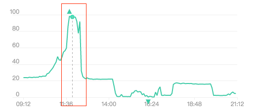
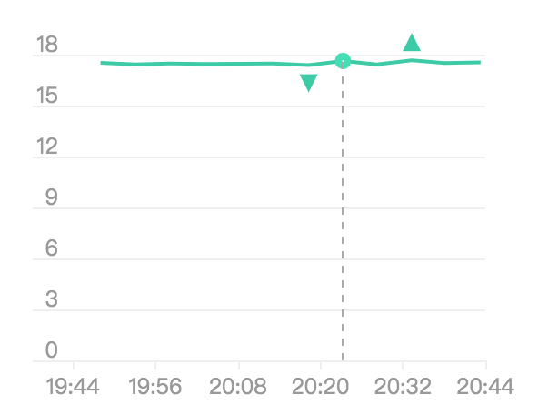
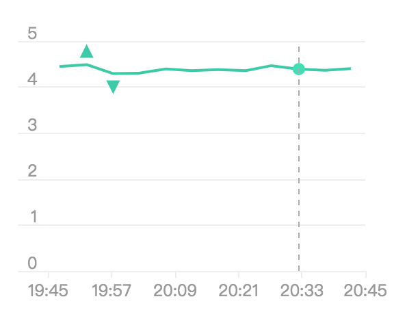

### k8s部署fabric-kafka


在k8s上部署fabric witch kafka consensus，相比之前部署fabric with solo consensus的区别就在于多了一个zk/kfk集群，在我们部署好zk/kfk后，对fabric.solo简单修改即可应用。

回顾一下，fabric.solo上解决了哪些问题：
1. docker dns，即在宿主机上启动链码容器，并保持链码容器和k8s pod的内通信问题；另外还有个改进，就是用k8s启动链码容器，这个可以参考IBM官方部署方案。
2. kubeadm构建k8s集群，这里遇到了，集群重启(kubeadm reset->kubeadm init)造成cni网络插件异常的情况。
3. 在单节点集群（只有master）上，k8s为master安全考虑，禁止在master node上调度节点，这只需要取消master taint即可。

在单节点k8s集群上，成功部署了fabric.solo；紧接着了，在k8s上又部署成功了zk/kfk集群。此时，部署fabric with kafka consensus的条件我们都具备了，那是否可部署成功了呢。
事实上，流程已经打通了，但没想到fabrci with kfk，需要太多的pod，这就导致，我那台2c4g的机器，cpu满载了，以至于无法操作终端。




（红线部分是当时的cpu满载情况）

所以，还有个工作要做，单节点集群无法满足fabric with kfk的性能要求，我们需要对k8s扩容，这里我又开了一台主机，打算搭建两节点的集群。这样后续，通过调度手段，将pod分布到两台机器上，就可以满足fabric with kfk的性能要求了。

在部署两节点的k8s集群上，又遇到了一些问题，我用官方的kubeadm教程方式搭建，在新机器上，安装的kube都是1.14.2的，索性为了统一，也将旧机器上的kube更换成了1.14.2。看似没问题，但是在启动集群时发现，拉取不到k8s.gcr.io下的镜像，配置代理后，仍是无法获取到k8s.gcr.io下镜像，奇怪的是，我那台旧机器上，居然有1.14.2的镜像，我也没使用过其他手段（比如大tag的方式）获取最新镜像呀。之前的版本都可以通过获取别人存的镜像，再打个tag就好，但是1.14.2可能太新，愣是没找到私人存储的镜像，所以当天工作大多是用来找镜像了。还好，最后找到[aws为国内提供k8s.gcr.io的镜像站点```gcr.azk8s.cn```](https://ieevee.com/tech/2019/03/02/azure-gcr-proxy.html)，通过该站点可以获取到最新的1.14.2镜像，之后再打tag就好。获取到镜像好，很快就部署好了双节点集群。

同样要注意的是，取消掉master node的taints(node-role.kubernetes.io/master),以及kubeadm reset之后的cni插件无法工作的处理。

这样，我们的集群有了两个可以部署pod节点，我们就可以通过affinity或者taints进行一个高级调度，将pod分散到两个node上，我这里采用了较为简单的方式，对node搭上标签，然后通过NodeSelector将pod调度到指定node上。我的安排是，zk/kfk在一个节点上，fabric那一套在一个节点上。

具体过程不在叙述，看一下搭建的集群状况。
```bash
root@hw2:~# kubectl version --short 
Client Version: v1.14.2
Server Version: v1.14.2
root@hw2:~# 
root@hw2:~# kubectl get pods -nkube-system -owide
NAME                          READY   STATUS    RESTARTS   AGE     IP              NODE   NOMINATED NODE   READINESS GATES
coredns-fb8b8dccf-lgr8p       1/1     Running   0          4h22m   10.244.1.3      hw2    <none>           <none>
coredns-fb8b8dccf-vx8lv       1/1     Running   0          4h22m   10.244.1.2      hw2    <none>           <none>
etcd-hw1                      1/1     Running   0          4h21m   192.168.0.109   hw1    <none>           <none>
kube-apiserver-hw1            1/1     Running   0          4h21m   192.168.0.109   hw1    <none>           <none>
kube-controller-manager-hw1   1/1     Running   0          4h21m   192.168.0.109   hw1    <none>           <none>
kube-flannel-ds-amd64-r57jp   1/1     Running   0          4h20m   192.168.0.109   hw1    <none>           <none>
kube-flannel-ds-amd64-vfxks   1/1     Running   0          4h20m   192.168.0.105   hw2    <none>           <none>
kube-proxy-4t268              1/1     Running   0          4h22m   192.168.0.109   hw1    <none>           <none>
kube-proxy-x4xhs              1/1     Running   0          4h22m   192.168.0.105   hw2    <none>           <none>
kube-scheduler-hw1            1/1     Running   0          4h21m   192.168.0.109   hw1    <none>           <none>
root@hw2:~# 
```

---
上述为部署fabric with kfk的前提，这里进行部署操作。

**部署zk/kfk**

按照之前部署zk/kfk的方式，部署zk/kfk集群，但是在zk/kfk的StatefulSet上指定了NodeSelector，将zk/kfk部署到一个节点上。
```yaml
    spec:
      nodeSelector:
        type: hw1
```

**部署fabric部分**

我们使用部署solo的fabric代码，需要修改configtx.yaml文件：
   1. 将orderer算法改为kafka，
   2. 修改kafka的Brokers地址。并重新生成通道文件、初始化块、密钥等。

这里配置的是kafka-pod的dns解析地址，这是一个典型的statefulSet控制下pod的地址，其地址构成为podName-n.StatefulSetHeadlessService.namespaces。
```yaml
Orderer: &OrdererDefaults

    # Orderer Type: The orderer implementation to start
    # Available types are "solo" and "kafka"
    OrdererType: kafka
    ...

    Kafka:
        # Brokers: A list of Kafka brokers to which the orderer connects. Edit
        # this list to identify the brokers of the ordering service.
        # NOTE: Use IP:port notation.
        Brokers:
            - kafka-0.kafka-headless.default:9092
            - kafka-1.kafka-headless.default:9092
            - kafka-2.kafka-headless.default:9092
```

生成相关文件。

```bash
root@hw2:~/go/src/github.com/hyperledger/fabric/examples/e2e_cli# ./generateArtifacts.sh 
mychannel

Using cryptogen -> /root/go/src/github.com/hyperledger/fabric/examples/e2e_cli/../../release/linux-amd64/bin/cryptogen

##########################################################
##### Generate certificates using cryptogen tool #########
##########################################################
org1

Using idemixgen -> /root/go/src/github.com/hyperledger/fabric/examples/e2e_cli/../../release/linux-amd64/bin/idemixgen

####################################################################
##### Generate idemix crypto material using idemixgen tool #########
####################################################################
Using configtxgen -> /root/go/src/github.com/hyperledger/fabric/examples/e2e_cli/../../release/linux-amd64/bin/configtxgen
##########################################################
#########  Generating Orderer Genesis block ##############
##########################################################
2019-05-18 17:15:07.548 CST [common/tools/configtxgen] main -> INFO 001 Loading configuration
2019-05-18 17:15:07.567 CST [msp] getMspConfig -> INFO 002 Loading NodeOUs
2019-05-18 17:15:07.567 CST [common/tools/configtxgen] doOutputBlock -> INFO 003 Generating genesis block
2019-05-18 17:15:07.568 CST [common/tools/configtxgen] doOutputBlock -> INFO 004 Writing genesis block

#################################################################
### Generating channel configuration transaction 'channel.tx' ###
#################################################################
2019-05-18 17:15:07.598 CST [common/tools/configtxgen] main -> INFO 001 Loading configuration
2019-05-18 17:15:07.616 CST [common/tools/configtxgen] doOutputChannelCreateTx -> INFO 002 Generating new channel configtx
2019-05-18 17:15:07.617 CST [msp] getMspConfig -> INFO 003 Loading NodeOUs
2019-05-18 17:15:07.617 CST [common/tools/configtxgen] doOutputChannelCreateTx -> INFO 004 Writing new channel tx

#################################################################
#######    Generating anchor peer update for Org1MSP   ##########
#################################################################
2019-05-18 17:15:07.669 CST [common/tools/configtxgen] main -> INFO 001 Loading configuration
2019-05-18 17:15:07.687 CST [common/tools/configtxgen] doOutputAnchorPeersUpdate -> INFO 002 Generating anchor peer update
2019-05-18 17:15:07.687 CST [common/tools/configtxgen] doOutputAnchorPeersUpdate -> INFO 003 Writing anchor peer update

#################################################################
#######    Generating anchor peer update for Org2MSP   ##########
#################################################################

```

接着，为了将fabric相关组件orderer、peer、cli的pod调度到指定node上，需要对fabric k8s部署文件适当修改，在orderer、org1、cli deployment上添加NodeSelector。
orderer
```yaml
---
kind: Deployment
apiVersion: extensions/v1beta1
metadata:
  name: orderer/peer1/peer2/cli
  namespace: ord/org1/org1/org1
spec:
  replicas: 1
  template:
    metadata:
      labels:
        app: orderer
    spec:
      nodeSelector:
        type: hw2
      containers:
      hostname: orderer
    ...
```


至此，我们可以启动fabric部分，并进入测试

---

首先看下集群上zk/kfk和fabric的pod情况，可以看到zk/kfk在hw1上，fabric部分在hw2上。

节点分布
```bash
root@hw2:~# kubectl get pods -owide
NAME                READY   STATUS    RESTARTS   AGE    IP            NODE   NOMINATED NODE   READINESS GATES
busybox             1/1     Running   2          157m   10.244.1.18   hw2    <none>           <none>
kafka-0             1/1     Running   0          44m    10.244.0.21   hw1    <none>           <none>
kafka-1             1/1     Running   0          44m    10.244.0.23   hw1    <none>           <none>
kafka-2             1/1     Running   0          43m    10.244.0.24   hw1    <none>           <none>
kafka-test-client   1/1     Running   0          44m    10.244.0.22   hw1    <none>           <none>
zk-0                1/1     Running   0          45m    10.244.0.18   hw1    <none>           <none>
zk-1                1/1     Running   0          45m    10.244.0.19   hw1    <none>           <none>
zk-2                1/1     Running   0          45m    10.244.0.20   hw1    <none>           <none>
root@hw2:~# kubectl get pods -nord -owide
NAME                       READY   STATUS    RESTARTS   AGE   IP            NODE   NOMINATED NODE   READINESS GATES
orderer-7787cc9d7d-d855h   1/1     Running   0          14m   10.244.1.23   hw2    <none>           <none>
root@hw2:~# kubectl get pods -norg1 -owide
NAME                     READY   STATUS    RESTARTS   AGE   IP            NODE   NOMINATED NODE   READINESS GATES
cli-7b57bbffcf-dnhpd     1/1     Running   0          12m   10.244.1.26   hw2    <none>           <none>
peer0-777dd85f9b-4kv9b   1/1     Running   0          13m   10.244.1.24   hw2    <none>           <none>
peer1-864697ffd5-8vvrm   1/1     Running   0          13m   10.244.1.25   hw2    <none>           <none>
root@hw2:~# 
```
并看一下两台机器的负载情况。



(node1 cpu负载情况，node1上部署这zk/kfk)



(node2 cpu负载情况，node2上部署着fabric部分)


现在，我们进入fabric cli pod执行测试脚本，依次是osn服务发现、创建通道、加入通道、安装链码、实例化链码和查询操作。如下日志，已经清理一些无用消息，最终我们可以查询到a的值100。

```bash
root@cli-7b57bbffcf-dnhpd:/opt/gopath/src/github.com/hyperledger/fabric/peer# ./scripts/script.sh

 ____    _____      _      ____    _____           _____   ____    _____ 
/ ___|  |_   _|    / \    |  _ \  |_   _|         | ____| |___ \  | ____|
\___ \    | |     / _ \   | |_) |   | |    _____  |  _|     __) | |  _|  
 ___) |   | |    / ___ \  |  _ <    | |   |_____| | |___   / __/  | |___ 
|____/    |_|   /_/   \_\ |_| \_\   |_|           |_____| |_____| |_____|

Channel name : mychannel

2019-05-17 12:50:07.354 UTC [channelCmd] InitCmdFactory -> INFO 003 Endorser and orderer connections initialized
2019-05-17 12:50:07.360 UTC [cli.common] readBlock -> INFO 004 Received block: 0
===================== Ordering Service is up and running ===================== 

2019-05-17 12:50:36.863 UTC [channelCmd] InitCmdFactory -> INFO 003 Endorser and orderer connections initialized
2019-05-17 12:50:36.901 UTC [cli.common] readBlock -> INFO 004 Got status: &{NOT_FOUND}
2019-05-17 12:50:36.906 UTC [channelCmd] InitCmdFactory -> INFO 005 Endorser and orderer connections initialized
2019-05-17 12:50:37.107 UTC [cli.common] readBlock -> INFO 006 Got status: &{SERVICE_UNAVAILABLE}
2019-05-17 12:50:37.110 UTC [channelCmd] InitCmdFactory -> INFO 007 Endorser and orderer connections initialized
2019-05-17 12:50:37.312 UTC [cli.common] readBlock -> INFO 008 Received block: 0
===================== Channel 'mychannel' created ===================== 

2019-05-17 12:50:51.718 UTC [channelCmd] InitCmdFactory -> INFO 003 Endorser and orderer connections initialized
2019-05-17 12:50:51.808 UTC [channelCmd] executeJoin -> INFO 004 Successfully submitted proposal to join channel
===================== peer0.org1 joined channel 'mychannel' ===================== 

2019-05-17 12:50:53.866 UTC [channelCmd] InitCmdFactory -> INFO 003 Endorser and orderer connections initialized
2019-05-17 12:50:53.937 UTC [channelCmd] executeJoin -> INFO 004 Successfully submitted proposal to join channel
===================== peer1.org1 joined channel 'mychannel' ===================== 

2019-05-17 12:51:08.487 UTC [channelCmd] InitCmdFactory -> INFO 003 Endorser and orderer connections initialized
2019-05-17 12:51:08.605 UTC [channelCmd] update -> INFO 004 Successfully submitted channel update
===================== Anchor peers updated for org 'Org1MSP' on channel 'mychannel' ===================== 

2019-05-17 12:54:23.884 UTC [chaincodeCmd] install -> INFO 005 Installed remotely response:<status:200 payload:"OK" > 
===================== Chaincode is installed on peer0.org1 ===================== 

===================== Chaincode is instantiated on peer0.org1 on channel 'mychannel' ===================== 

===================== Querying on peer0.org1 on channel 'mychannel'... ===================== 
Attempting to Query peer0.org1 ...3 secs

value is 100
===================== Query successful on peer0.org1 on channel 'mychannel' ===================== 
# exit

```

---
END,经过kubeadm集群搭建、k8s部署fabric.solo再到k8s部署zk/kfk、k8s部署fabric.kfk,最终实现了用k8s部署管理fabric的目标。


参考：
1. [Azure中国提供了gcr.io/k8s.gcr.io镜像代理服务 by 伊布](https://ieevee.com/tech/2019/03/02/azure-gcr-proxy.html)
2. [azure开源镜像站点](http://mirror.azure.cn/)
