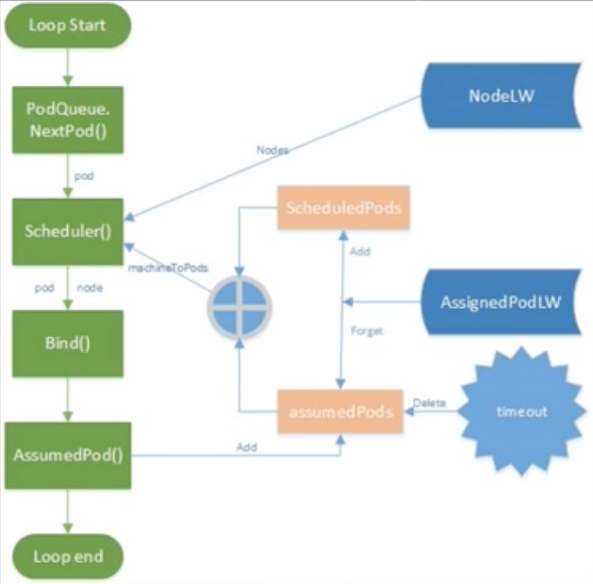
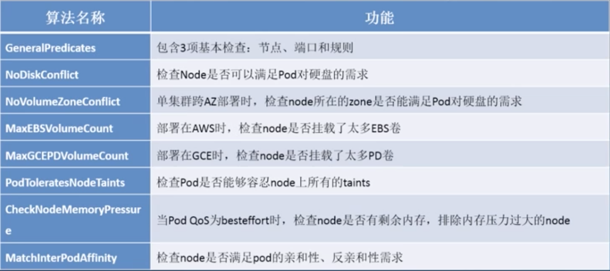
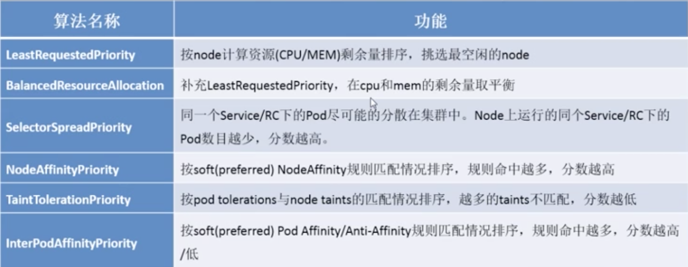
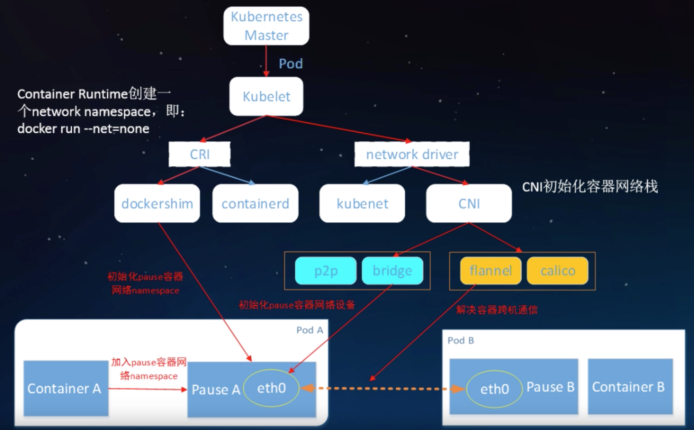
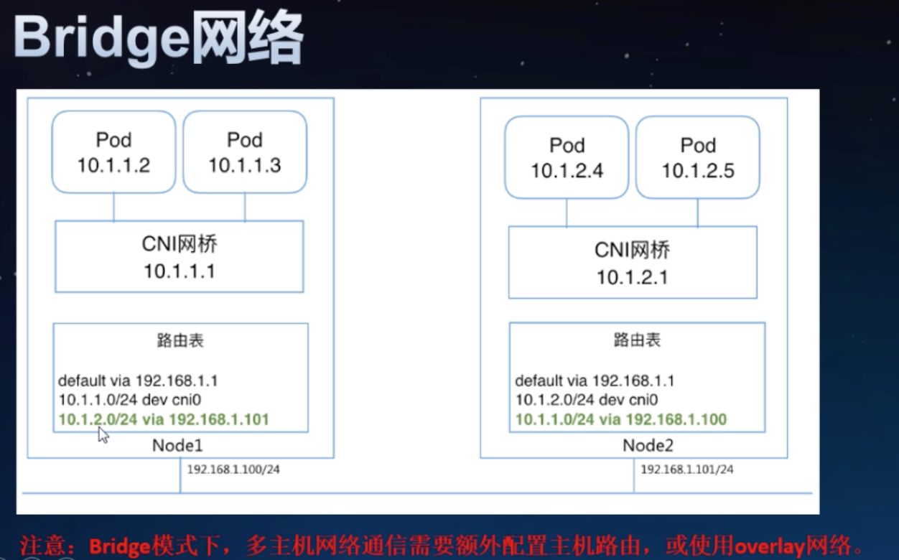
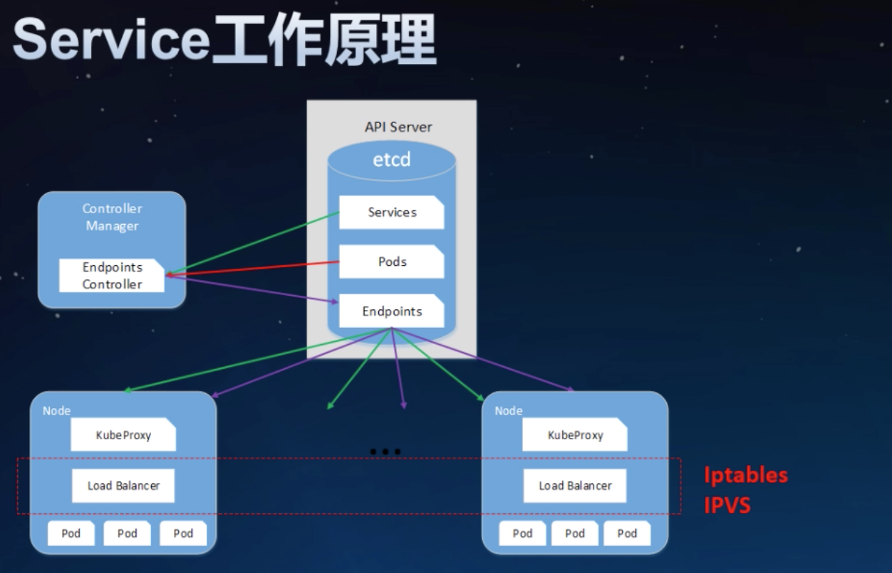
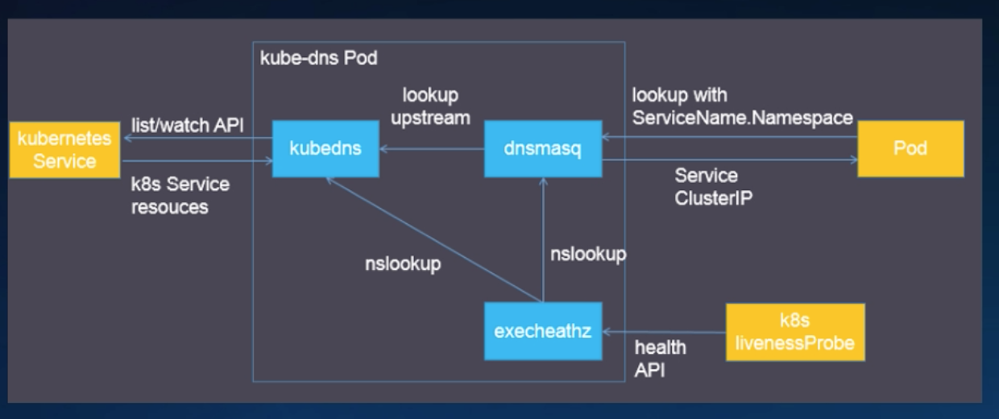
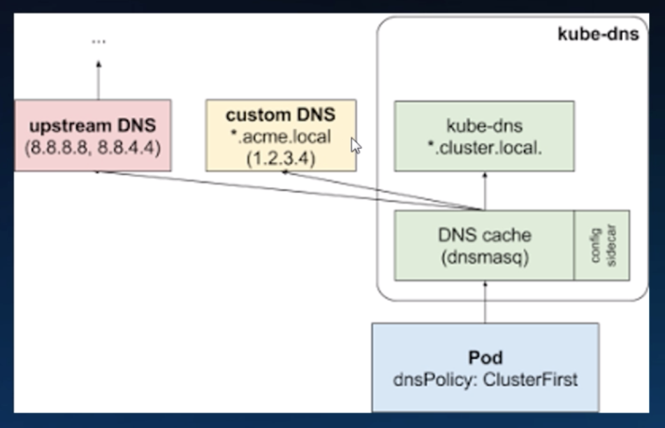
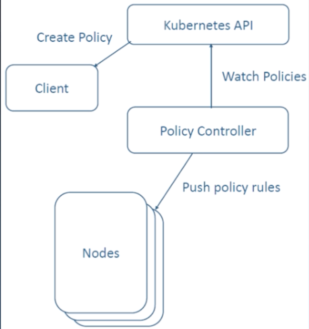

### k8s调度器原理剖析与实践

k8s调度机制介绍、k8s中的调度策略与算法、k8s高级调度特性详解


#### Scheduler: 为Pod找到一个合适的Node?

调度器的特点是，所处理的是Pod，它的输入就是不断的从集群中获取可用的节点，以及集群中有哪些带调度的pod，经过调度器的处理将pod调度到合适的节点上；
从yaml文件看，经过调度器处理后，填入了NodeName


default scheduler:
1. 基于队列的调度器
2. 一次调度一个pod
3. 调度时刻全局最优的节点

从外部流程看调度器，从pod创建到pod被bind结束




调度器内部流程：
1. 通过NodeLister获取所有节点信息；
2. 整合scheduled pods和assume pods，合并到pods,作为所有已调度pod信息；
3. 从pods中整理出node-pods的对应关系表nodeNameToInfo;
4. 过滤不合适节点；
5. 给剩下的节点依次打分；
6. 在分数最高的nodes中随机选择一个即节点用于绑定。这是为了避免分数最高的节点被几次调度撞车


#### k8s中的调度策略与算法

Predicates:过滤类的；Priorities:评分类

通过Predicate策略筛选符合条件的Node，过滤“不合格”节点，避免资源冲突、节点超载



GeneralPredicates: 包含三项基本检查：节点、端口、规则


PodToleratesNodeTaints: 检查Pod是否能够


通过Priority策略给剩余的Node评分，挑选最优的节点，挑选“优质”节点，优化资源分配、应用分布



#### k8s高级调度特性

label&selector

任意的metadata,所有api对象都有label,通常用来标记“身份”，可以查询时用selector过滤，类似sql'select ... where'

Node Affinity让pod在一组指定Node上运行

Pod Affinity 让pod与指定service的一组pod在相同node上运行

#内置的key,topologyKey: "hostname"

Pod Anfti-Affinity 让通一个Service的pod分散到不同Node上运行

Taints-tolerations 来自Node的反亲和和配置


--- 

### K8S网络模型原理剖析与实践

网络模型与CNI、Service、Ingress、DNS、Network Policy

#### k8s网络模型与cni


一个pod一个ip：
1. 每个pod独立ip,pod内所有容器共享网络namespace(同一个ip)
2. 容器之间直接通信，不需要NAT
3. Node和容器直接通信，不需要NAT
4. 其他容器和容器自身看到的IP是一样的

集群内访问Service, 集群外访问走Ingress

CNI(container network interface)用于配置pod网络


kubelet做两件事，CRI启动容器，CNI配置网络栈


network driver: kubenet,cni

cni:p2p,bridger初始化pause容器网络设备，flannel、calico解决容器跨主机通信


bridge: 网桥内pod间广播消息，跨主机需要配置额外的路由表，流量走在主机上

overlay网络： 主机内pod还是在网桥上，主机间通过overlay进行，主机上增加了tun0设备用于走向外的流量，路由表上指向tun0


CNI:
1. 容器网络的标准化
2. 使用json来描述网络配置
3. 两类接口：配置网络、清理网络

CNI插件：带宽控制


Service: 虚拟ip（cluster ip）+端口，能够持久存在
Endpoints: 是实际的网络地址

Endpoints Controller（in cm）会监控Service和Pod的创建，生成Endpoints对象
Node上kube-proxy会监控Service和Endpoints对象，根据Service和Endpoints创建路由规则,是的虚拟ip能够被路由；
kube-proxy下是load-balancer,由他们实现流量转发，目前是iptables和ipvs,iptables数据量大时性能较差。

Service类型；
1. cluster ip:默认类型，自动分配集群内部可以访问的虚ip--cluster ip
2. NodePort: 为Service在k8s集群的每个node上分配一个端口，即NodePort,集群内/外部可基于任何一个NodeIP:NodePort的形式来访问Service
3. LoadBalancer: 
    1. 需要跑在特定的cloud provider上
    2. Service controller自动创建一个外部LB并配置安全组
    3. 对集群内访问,kube-proxy用iptables或ipvs实现了云服务提供商LB的部分功能：L4转发，安全组规则等


#### K8S服务发现

1. 环境变量：kubelet为每个pod注入所有Service的环境变量信息，缺点是环境变量洪泛，docker启动参数过长直接导致启动容器失败
2. 域名：
    1. A记录：mysvc.myns ->cluster ip
    2. srv记录： http.tcp.mysvc.ns ->端口

Service实现机制（iptables vs ipvs)


如何从集群外访问k8s Service?
1. 使用NodePort类型的Service: 要求Node有对外可访问的ip
2. 使用loadbalancer类型的service:要求在特定的云服务上跑k8s

Service只提供L4负载均衡，而没有L7功能。

#### Ingress

Ingress是授权入站连接到达集群服务的规则集合：
1.  支持通过URL方式将Service暴露到k8s集群外，Service之上的L7访问入口
2. 支持自定义Service的访问策略
3. 提供按域名访问虚拟主机功能
4. 支持TLS

ingress address，ingress的访问入口地址，由ingress controller分配backend:k8s service + port ,rule:自定义访问策略，当规则为空，则访问address的所有流量都转发给backend.


Ingress DIY:
1. 需要自己实现ingress control: 
    1. list/watch k8s的service,endpoints,ingress对象，刷新外部lb的规则和配置
    2. 官方提供nginx和gce的ingress controller示例
2. 想通过域名访问ingress?需要自己配置域名和ingress ip的映射：host文件，或者自己的dns（不是kube-dns)，集群外部的dns
3. 嫌麻烦，懒得开发/配置？hw cce?ingress+高性能elb -广告

#### DNS:
1. 解析pod和service的域名，集群内的pod使用
2. kube-dns和core dns
3. 对service有A记录（普通service和headless返回pod ip列表）和SRV记录
4. 对pod只有A记录(pod-ip.ns,或者指定了hostname和subdomain，则hostname.subdomain.ns)

kube-dns:
kubdns: list/watch k8s service和endpoints变化，接入skydns,在内存中维护DNS记录，是dnsmasq的上游
dnsmasq: dns配置工具，监听53端口，为集群提供DNS查询服务，提供DNS缓存，降低kubedns压力
sidecar: 健康检查，检查kube-dns和dnsmasq的健康



kube-dns级联查询


默认pod会从node继承dns服务器配置，也可以通过kubelet的--resolv-conf配置


#### Network Policy是什么


1. 基于源ip的访问控制列表：限制pod的进/出流量，白名单（写什么，什么可以进来）
2. Pod网络隔离的一层抽象：label selector,namespace selector,port,cidr
3. 没有network policy: “全网通“
4. 网络插件实现policy controller,

NetworkPolicy spec.ingress/egress 配置{}表示允许所有，[]表示禁止所有;也支持端口控制


支持Network-policy:calico,cilium,weave net,kube-router,romana

flannel和kubernet不支持policy

#### docker和host的进程关系、网络关系测试
```bash
不分配网络地址

root@node1:~# contid=$(docker run -d --net=none busybox:latest /bin/sleep 100000)

root@node1:~# docker exec -it $contid sh
/ # ls
bin   dev   etc   home  proc  root  sys   tmp   usr   var
/ # top
Mem: 1923772K used, 117448K free, 9480K shrd, 164040K buff, 819256K cached
CPU: 30.0% usr 20.0% sys  0.0% nic 50.0% idle  0.0% io  0.0% irq  0.0% sirq
Load average: 0.09 0.15 0.22 2/740 14
  PID  PPID USER     STAT   VSZ %VSZ CPU %CPU COMMAND
    6     0 root     S     1316  0.0   0  0.0 sh
   14     6 root     R     1308  0.0   0  0.0 top
    1     0 root     S     1296  0.0   0  0.0 /bin/sleep 100000
/ # 

root@node1:~# ps -eaf |grep sleep
root     18246 18211  0 14:52 ?        00:00:00 /bin/sleep 100000
root@node1:~# ps  -ef |grep  18211
root     18211  8379  0 14:52 ?        00:00:00 containerd-shim -namespace moby -workdir /var/lib/containerd/io.containerd.runtime.v1.linux/moby/8d77acef9c42f63a03c05ca752db9d00934a2b5a97d2e57ab5ed3dc19060e8fb -address /run/containerd/containerd.sock -containerd-binary /usr/bin/containerd -runtime-root /var/run/docker/runtime-runc
root     18246 18211  0 14:52 ?        00:00:00 /bin/sleep 100000
root     24001 17867  0 15:05 pts/0    00:00:00 grep --color=auto 18211

root@node1:~# ps -ef |grep 18211
root@node1:~# ps -ef |grep 8379
root      8379     1  0 Jun29 ?        00:12:48 /usr/bin/containerd

```
看到parent pid有0号进程，linux中没有0号进程，init是1号进程，真正的容器一个只有一个进程pid=1,ppid=0,docker deamon运行了一个进程，注意docker中1号进程不是linux中那个最大的init进程，它只是一个普通的运行进程，sh的ppid=0该进程也是来自于外部；
而ponch富容器则需要实现一个复杂的init

从例子中我们可以看到sleep在docker有实际的运行sleep进程，通过父进程最终找到containerd。

dockerd 启动了一个shim,这个shim拉起容器，把这个进程放到容器了


```bash

root@node1:~# pid=$(docker inspect -f '{{ .State.Pid }}' $contid)
root@node1:~# echo $pid
18246
root@node1:~# netnspath=/proc/$pid/ns/net
root@node1:~# echo $netnspath
/proc/18246/ns/net
root@node1:~# cd $netnspath
root@node1:/proc/18246/ns# pwd
/proc/18246/ns
root@node1:/proc/18246/ns# ls
cgroup  ipc  mnt  net  pid  pid_for_children  user  uts
root@node1:/proc/18246/ns# 
```


```bash
root@node1:~# docker exec -it $confit sh
/ # ifconfig
lo        Link encap:Local Loopback  
          inet addr:127.0.0.1  Mask:255.0.0.0
          UP LOOPBACK RUNNING  MTU:65536  Metric:1
          RX packets:0 errors:0 dropped:0 overruns:0 frame:0
          TX packets:0 errors:0 dropped:0 overruns:0 carrier:0
          collisions:0 txqueuelen:1000 
          RX bytes:0 (0.0 B)  TX bytes:0 (0.0 B)

/ # 
/ # exit
root@node1:~# 
```
可以通过配置上个容器的bridge参数，让bridge为该容器配置一个网络接口eth0
之后，通过docker run --net=container:$contid busybox:latest /bin/sh 复用容器contid的网络


