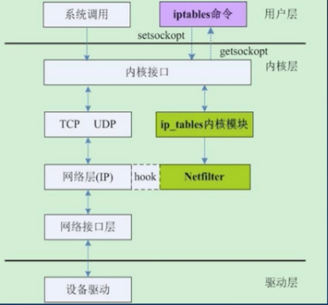
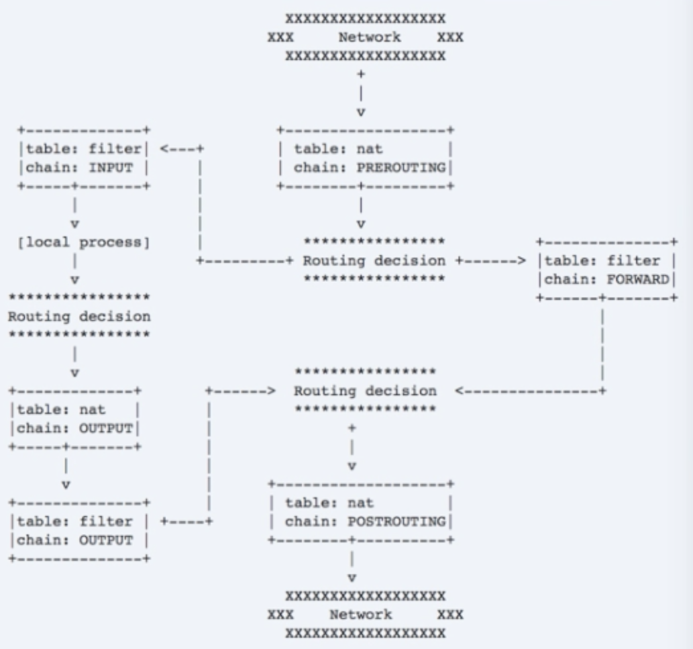

### k8s工作负载原理和实践

Pod,最小的部署单元，其上一层workload,即controller,有四种模式：无状态模式、守护进程模式、有状态模式、批处理模式；

#### 无状态模式：
1. 不必为应用保持状态/持久化数据
2. 典型应用代表：Nginx,Tomcat
3. Replication Controller
4. ReplicaSet,基于集合的label selector,RS支持基于集合运算符，NotIn,Exists,DoesNotExist
5. Deployment,提供了声明式、自定义策略的Pod升级支持

升级/回滚：
```bash
kubectl set ...
kubectl rollout history ...
kubectl roullout undo ...
```

暂停/恢复
```bash
kubectl rollout pause deployment ...
kubeclt rollout resume deployment ...
```

弹性、按比例扩/缩容
```
kubeclt scale deployment/... --replicas=10
kubectl autoscal deployment nginx-deployment --min=10 --max=15 --cpu-percent=80 //需要和hpa联动
maxSurge=3
maxUnavailable=2
```


#### 有状态模式

1. 典型应用：zookeeper、mongodb,mysql,etcd
2. statefulSet(曾用名：PetSet)
3. StatefulSet的pod和普通Pod区别：有身份
4. StatefulSet身份三要素:
    1. 域名(网络)<- 容器ip易变
    2. pvc(存储)
    3. pod name(主机名)
5. 配合headless service（没有cluster ip的svc）,pvc一起使用
6. 严格的启动/删除顺序：0，1，2


#### 守护进程模式

1. 典型应用： fluentd,linkderd,ceph,kube-proxy
2. DaemonSet: 保证每个节点总是运行一个pod实例
    1. NodeSelector或NodeAffinity指定Node
    2. 经过/不经过调度器（不管Node状态）
    3. 支持滚动升级
    4/ 支持级联/非级联删除


经过调度器，如果不经过调度器直接跳过了pendding状态，与其他pod状态不一致


#### 批处理模式

1. 典型应用：并发执行的作用，batch job;相关但独立的工作项：发邮件、数据扫描、文件转码
2. job
    1. 保证指定数量pod成功运行结束-completions
    2. 支持并行-paralelism
    3. 支持错误自动重试（10s,20s,40s,...6min),
    4. 删除job会触发对应pod删除

3. cronjob
    1. 基于时间调度的job(cron格式)
    2. 用户可以暂停/恢复jo的周期性调度.spec.suspend=(true,flase)
    3. 管理job->pod

backoffLimit：5限制出错次数
activeDeadlineSeconds:100,限制dead时间


k8s常见使用方法：
1. 做不同的事情：扩展job Expansion，传入参数、环境变量
2. 做同样的事情：工作队列形式，与work queque（rabbitmq)结合

cronjob
```spec.schedule: * * /1 * * * * *```


总结：
1. 无状态模式：使用deployment提供高可用、弹性扩/缩容、升级/回滚
2. 有状态模式：使用StatefulSet提供一致性，Pod的唯一/粘性的身份标识、存储，按序部署、扩缩容
3. 守护进程模式：一个节点部署一个（可自定义节点范围）
4. 批处理模式：并行跑多个pod,并且保证都成功返回

---
### k8s调度器原理剖析与实践

k8s调度机制介绍、k8s中的调度策略与算法、k8s高级调度特性详解


#### Scheduler: 为Pod找到一个合适的Node?

调度器的特点是，所处理的是Pod，它的输入就是不断的从集群中获取可用的节点，以及集群中有哪些带调度的pod，经过调度器的处理将pod调度到合适的节点上；
从yaml文件看，经过调度器处理后，填入了NodeName


default scheduler:
1. 基于队列的调度器
2. 一次调度一个pod
3. 调度时刻全局最优的节点

从外部流程看调度器，从pod创建到pod被bind结束


调度器内部流程：
1. 通过NodeLister获取所有节点信息；
2. 整合scheduled pods和assume pods，合并到pods,作为所有已调度pod信息；
3. 从pods中整理出node-pods的对应关系表nodeNameToInfo;
4. 过滤不合适节点；
5. 给剩下的节点依次打分；
6. 在分数最高的nodes中随机选择一个即节点用于绑定。这是为了避免分数最高的节点被几次调度撞车


#### k8s中的调度策略与算法

Predicates:过滤类的；Priorities:评分类

通过Predicate策略筛选符合条件的Node，过滤“不合格”节点，避免资源冲突、节点超载


GeneralPredicates: 包含三项基本检查：节点、端口、规则


PodToleratesNodeTaints: 检查Pod是否能够


通过Priority策略给剩余的Node评分，挑选最优的节点，挑选“优质”节点，优化资源分配、应用分布


#### k8s高级调度特性

label&selector

任意的metadata,所有api对象都有label,通常用来标记“身份”，可以查询时用selector过滤，类似sql'select ... where'

Node Affinity让pod在一组指定Node上运行

Pod Affinity 让pod与指定service的一组pod在相同node上运行

#内置的key,topologyKey: "hostname"

Pod Anfti-Affinity 让通一个Service的pod分散到不同Node上运行

Taints-tolerations 来自Node的反亲和和配置


--- 

### K8S网络模型原理剖析与实践

网络模型与CNI、Service、Ingress、DNS、Network Policy

#### k8s网络模型与cni


一个pod一个ip：
1. 每个pod独立ip,pod内所有容器共享网络namespace(同一个ip)
2. 容器之间直接通信，不需要NAT
3. Node和容器直接通信，不需要NAT
4. 其他容器和容器自身看到的IP是一样的

集群内访问Service, 集群外访问走Ingress

CNI(container network interface)用于配置pod网络


kubelet做两件事，CRI启动容器，CNI配置网络栈


network driver: kubenet,cni

cni:p2p,bridger初始化pause容器网络设备，flannel、calico解决容器跨主机通信


bridge: 网桥内pod间广播消息，跨主机需要配置额外的路由表，流量走在主机上

overlay网络： 主机内pod还是在网桥上，主机间通过overlay进行，主机上增加了tun0设备用于走向外的流量，路由表上指向tun0


CNI:
1. 容器网络的标准化
2. 使用json来描述网络配置
3. 两类接口：配置网络、清理网络

CNI插件：带宽控制


Service: 虚拟ip（cluster ip）+端口，能够持久存在
Endpoints: 是实际的网络地址

Endpoints Controller（in cm）会监控Service和Pod的创建，生成Endpoints对象
Node上kube-proxy会监控Service和Endpoints对象，根据Service和Endpoints创建路由规则,是的虚拟ip能够被路由；
kube-proxy下是load-balancer,由他们实现流量转发，目前是iptables和ipvs,iptables数据量大时性能较差。

Service类型；
1. cluster ip:默认类型，自动分配集群内部可以访问的虚ip--cluster ip
2. NodePort: 为Service在k8s集群的每个node上分配一个端口，即NodePort,集群内/外部可基于任何一个NodeIP:NodePort的形式来访问Service
3. LoadBalancer: 
    1. 需要跑在特定的cloud provider上
    2. Service controller自动创建一个外部LB并配置安全组
    3. 对集群内访问,kube-proxy用iptables或ipvs实现了云服务提供商LB的部分功能：L4转发，安全组规则等


#### K8S服务发现

1. 环境变量：kubelet为每个pod注入所有Service的环境变量信息，缺点是环境变量洪泛，docker启动参数过长直接导致启动容器失败
2. 域名：
    1. A记录：mysvc.myns ->cluster ip
    2. srv记录： http.tcp.mysvc.ns ->端口

Service实现机制（iptables vs ipvs)


如何从集群外访问k8s Service?
1. 使用NodePort类型的Service: 要求Node有对外可访问的ip
2. 使用loadbalancer类型的service:要求在特定的云服务上跑k8s

Service只提供L4负载均衡，而没有L7功能。

#### Ingress

Ingress是授权入站连接到达集群服务的规则集合：
1.  支持通过URL方式将Service暴露到k8s集群外，Service之上的L7访问入口
2. 支持自定义Service的访问策略
3. 提供按域名访问虚拟主机功能
4. 支持TLS

ingress address，ingress的访问入口地址，由ingress controller分配backend:k8s service + port ,rule:自定义访问策略，当规则为空，则访问address的所有流量都转发给backend.


Ingress DIY:
1. 需要自己实现ingress control: 
    1. list/watch k8s的service,endpoints,ingress对象，刷新外部lb的规则和配置
    2. 官方提供nginx和gce的ingress controller示例
2. 想通过域名访问ingress?需要自己配置域名和ingress ip的映射：host文件，或者自己的dns（不是kube-dns)，集群外部的dns
3. 嫌麻烦，懒得开发/配置？hw cce?ingress+高性能elb -广告

#### DNS:
1. 解析pod和service的域名，集群内的pod使用
2. kube-dns和core dns
3. 对service有A记录（普通service和headless返回pod ip列表）和SRV记录
4. 对pod只有A记录(pod-ip.ns,或者指定了hostname和subdomain，则hostname.subdomain.ns)

kube-dns:
kubdns: list/watch k8s service和endpoints变化，接入skydns,在内存中维护DNS记录，是dnsmasq的上游
dnsmasq: dns配置工具，监听53端口，为集群提供DNS查询服务，提供DNS缓存，降低kubedns压力
sidecar: 健康检查，检查kube-dns和dnsmasq的健康


kube-dns级联查询


默认pod会从node继承dns服务器配置，也可以通过kubelet的--resolv-conf配置


#### Network Policy是什么


1. 基于源ip的访问控制列表：限制pod的进/出流量，白名单（写什么，什么可以进来）
2. Pod网络隔离的一层抽象：label selector,namespace selector,port,cidr
3. 没有network policy: “全网通“
4. 网络插件实现policy controller,

NetworkPolicy spec.ingress/egress 配置{}表示允许所有，[]表示禁止所有;也支持端口控制


支持Network-policy:calico,cilium,weave net,kube-router,romana

flannel和kubernet不支持policy

#### docker和host的进程关系、网络关系测试
```bash
不分配网络地址

root@node1:~# contid=$(docker run -d --net=none busybox:latest /bin/sleep 100000)

root@node1:~# docker exec -it $contid sh
/ # ls
bin   dev   etc   home  proc  root  sys   tmp   usr   var
/ # top
Mem: 1923772K used, 117448K free, 9480K shrd, 164040K buff, 819256K cached
CPU: 30.0% usr 20.0% sys  0.0% nic 50.0% idle  0.0% io  0.0% irq  0.0% sirq
Load average: 0.09 0.15 0.22 2/740 14
  PID  PPID USER     STAT   VSZ %VSZ CPU %CPU COMMAND
    6     0 root     S     1316  0.0   0  0.0 sh
   14     6 root     R     1308  0.0   0  0.0 top
    1     0 root     S     1296  0.0   0  0.0 /bin/sleep 100000
/ # 

root@node1:~# ps -eaf |grep sleep
root     18246 18211  0 14:52 ?        00:00:00 /bin/sleep 100000
root@node1:~# ps  -ef |grep  18211
root     18211  8379  0 14:52 ?        00:00:00 containerd-shim -namespace moby -workdir /var/lib/containerd/io.containerd.runtime.v1.linux/moby/8d77acef9c42f63a03c05ca752db9d00934a2b5a97d2e57ab5ed3dc19060e8fb -address /run/containerd/containerd.sock -containerd-binary /usr/bin/containerd -runtime-root /var/run/docker/runtime-runc
root     18246 18211  0 14:52 ?        00:00:00 /bin/sleep 100000
root     24001 17867  0 15:05 pts/0    00:00:00 grep --color=auto 18211

root@node1:~# ps -ef |grep 18211
root@node1:~# ps -ef |grep 8379
root      8379     1  0 Jun29 ?        00:12:48 /usr/bin/containerd

```
看到parent pid有0号进程，linux中没有0号进程，init是1号进程，真正的容器一个只有一个进程pid=1,ppid=0,docker deamon运行了一个进程，注意docker中1号进程不是linux中那个最大的init进程，它只是一个普通的运行进程，sh的ppid=0该进程也是来自于外部；
而ponch富容器则需要实现一个复杂的init

从例子中我们可以看到sleep在docker有实际的运行sleep进程，通过父进程最终找到containerd。

dockerd 启动了一个shim,这个shim拉起容器，把这个进程放到容器了


```bash

root@node1:~# pid=$(docker inspect -f '{{ .State.Pid }}' $contid)
root@node1:~# echo $pid
18246
root@node1:~# netnspath=/proc/$pid/ns/net
root@node1:~# echo $netnspath
/proc/18246/ns/net
root@node1:~# cd $netnspath
root@node1:/proc/18246/ns# pwd
/proc/18246/ns
root@node1:/proc/18246/ns# ls
cgroup  ipc  mnt  net  pid  pid_for_children  user  uts
root@node1:/proc/18246/ns# 
```


```bash
root@node1:~# docker exec -it $confit sh
/ # ifconfig
lo        Link encap:Local Loopback  
          inet addr:127.0.0.1  Mask:255.0.0.0
          UP LOOPBACK RUNNING  MTU:65536  Metric:1
          RX packets:0 errors:0 dropped:0 overruns:0 frame:0
          TX packets:0 errors:0 dropped:0 overruns:0 carrier:0
          collisions:0 txqueuelen:1000 
          RX bytes:0 (0.0 B)  TX bytes:0 (0.0 B)

/ # 
/ # exit
root@node1:~# 
```
可以通过配置上个容器的bridge参数，让bridge为该容器配置一个网络接口eth0
之后，通过docker run --net=container:$contid busybox:latest /bin/sh 复用容器contid的网络


---

### k8s服务发现与负载均衡原理剖析与实践

k8s的service机制;iptables实现service负载均衡;当前iptables实现存在的问题;ipvs实现service负载均衡;iptables vs. ipvs


用户和pod直接连接，简单但是有问题：
1. 多个后端实例如何做到负载均衡  
2. 如何保持会话亲和性
3. 容器迁移，ip发生变化如何访问
4. 健康检查怎么做
5. 怎么通过域名访问


k8s service 和  endpoints

svc
```yaml
apiVersion: v1
kind: Service
metadata:
  creationTimestamp: "2019-07-07T01:15:14Z"
  labels:
    run: docker
  name: docker
  namespace: default
  resourceVersion: "813652"
  selfLink: /api/v1/namespaces/default/services/docker
  uid: 9e89f78f-e578-4bd2-9c70-a0f125ab9e25
spec:
  clusterIP: 10.101.44.78 #虚ip
  ports:
  - port: 2375   //service port
    protocol: TCP
    targetPort: 2375  //pod port
  selector:
    name: docker
  sessionAffinity: None
  type: ClusterIP
status:
  loadBalancer: {}
```
endpoints
```yaml
apiVersion: v1
kind: Endpoints
metadata:
  annotations:
    endpoints.kubernetes.io/last-change-trigger-time: "2019-07-07T01:15:16Z"
  creationTimestamp: "2019-07-07T01:15:14Z"
  labels:
    run: docker
  name: docker
  namespace: default
  resourceVersion: "813673"
  selfLink: /api/v1/namespaces/default/endpoints/docker
  uid: 92e5dbde-11a0-4fda-a1ca-66eb188e2c9f
subsets:
- addresses:
  - ip: 10.244.0.52
    nodeName: node1
    targetRef:
      kind: Pod
      name: docker-dind-b6bfb4558-j4lfl
      namespace: default
      resourceVersion: "813672"
      uid: 7af91fd0-172b-4e54-8f5f-ef8b3916bb13
  ports:
  - port: 2375
    protocol: TCP
```

Service内部逻辑：


虚ip本身是没有意义的，那在集群中如何做到有意义的呢？
1. 用户创建service和pods
2. k8s的controller manager中endpoints controller或watch service和pod的变化更新，pods ready后会自动创建endpoints
3. 每个节点上都运行着一个kube-proxy,kube-proxy中有个组件load-balancer,这是一个虚拟的称呼，实际实现是iptables和ipvs


#### iptables

用户态程序，通过socket调用，通过配置Netfilter规则表（Xtables)来构建linux内核防火墙；此外，它还有DestNet功能，可以用来实现负载均衡



#### 网络包通过Netfilter全过程：4个表5个链

tables: net、filter、
chain: input、output、forward、prerouting、postrouting

当路由器用的，包经过forward链，从postrouting出去

如果这个包要进入主机中的进程，会经过input链,再发给本地进程；
本地进程的包要出去，要经过output链，最后从postrouting出去。

在链上挂一些钩子函数，完成地址转换，设置防火墙等等


#### iptables实现流量转发与负载均衡

iptables如何做流量转发？DNAT实现ip地址和端口映射
```bash
iptables -t nat -A PREROUTING -d 1.2.3.4/32 --dport 80 -j DNAT --to-destination 10.20.30.40:8080
//-t表示table ,假设1.2.3.4是service的ip,10.20.30.40是容器的ip，这样就做了一次转发
```
iptables如何做负载均衡？static模块为每个后端设置权重
```bash
iptables -t nat -A PREROUTING -d 1.2.3.4 --dport 80 -m statistic --mode random --probability .25  -j DNAT --to-destination 10.20.30.40:8080
```

iptables如何做会话保持？recent模块设置会话保持时间
```bash
iptables -t nat -A FOO -m recent --rcheck --seconds 3600 --reap --name BAR -j BAR
//保持3600秒
```
images/20190713-netfilter.png

#### iptables在k8s的应用

DNAT应用： cluster ip:port -> prerouting(/出去是output) -> kube-services -> kube-svc-xxx ->kube-sep-xxx ->pod ip:target port

1. 所有进入主机的包，不做任何匹配直接进入kube-service链中
2. kube-service链是有匹配的，目的地址+端口，会跳到kube-svc-xxx链中
3. kube-svc-xxx链没有匹配规则，直接跳到kube-sep-xxx链中
4. kube-sep-xxx链又一次DNAT操作，将包的目的地址改成容器的地址，实现了svc ip:port到pod id:port的转换


可通过如下命令查看iptables dnat实例：
```bash
iptables -t nat  -nL
```


iptables做负载均衡的问题：
1. 规则线性匹配：kube-services链挂了一长串kube-svc-xxx链；访问每个svc都要遍历每条链直到匹配，时间复杂度O(N)
2. 规则更新时延：非增量 
3. 可扩展性：当系统存在大量iptables规则链时，增加/删除规则会出现kernel lock
4. 可用性：后端实例扩容，服务会话保持时间更新等都会导致连接断开

xtables是内核中的数据结构，处在临界区

更新iptables规则的时研：
1. 时延出现在哪？
    1. 非增量式，即使加上--no-flush(iptables-restore)选项
    2. kube-proxy定期同步iptables状态：拷贝所有规则：iptables-save;在内存中更新规则;在内核中修改规则：iptables-restore;规则更新期间存在kernel lock。
2. 5k service(40k规则)，增加一条iptables规则，耗时11min
3. 20k service(160k规则)，增加一条iptables规则，耗时5h

iptables周期性刷新导致tps抖动

k8s Scalability :   
5k nodes,100k pod,1k services?


iptables优化：树形结构,会增加复杂度


#### 什么是IPVS(IP virtual server)

1. linux内核实现的L4 LB,LVS负载均衡实现
2. 基于netfilter,hash table
3. 支持tcp,udp,sctp协议，ipv4,ipv6
4. 支持多种负载均衡策略：rr,wrr,lc,wlc,sh,dh,lblc...
5. 支持会话保持：persistent connection调度算法
6. 支持三种LB模式：Direct Routing(DR),Tunneling NAT:
    1. DR模式工作在L2,最快，但不支持端口映射
    2. Tunneling模式用ip包封装ip包，也称ipip模式，不支持端口映射，(隧道模式)
    3. dr和tunneling模式，回程报文不会经过ipvs director
    4. nat模式支持端口映射，回程报文经过ipvs director:内核原生只做DNAT，不做SNAT


#### IPVS做L4转发

1. 绑定VIP
```bash
#dummy网卡
ip link add dev dummy0 type dummy
ip addr add 192.168.2.2/32 dev dummy0
#本地路由表
ip route add to local 192.168.2.2/32 dev eth0 proto kernel
#网卡别名
ifconfig eth0:1 192.168.2.2 netmask 255.255.255.255 up
```

2.  创建ipvs virtual server
```bash
ipvsadm -A -t 192.168.60.200:80 -s rr -p 600
```
3. 创建IPVS Real Server
```bash
ipvsadm -a -t 192.168.60.200:80 -r 172.17.1.2:80 -m
ipvsadm -a -t 192.168.60.200:80 -r 172.17.2.3:80 -m
```

iptables的特性ipvs都支持，兼容network policy,依赖iptables做snat和访问控制


Iptables vs. IPVS

iptables:
1. 灵活，功能强大
2. 在prerouting,postrouting,forward,input,output不同阶段都能对包进行操作
IPVS:
1. 更好的性能（hash vs chain)
2. 更多的负载均衡算法（rr,wrr,lc,wlc,ip hash...)
3. 连接保持：ipvs service 更新期间，保持连接不断开
4. 预先加载内核模：nf_conntrack_ipv4,ip_vs,ip_vs_rr,ip_vs_wrr,ip_vs_sh...
5. echo 1 > /proc/sys/net/ipv4/vs/conntrack

为什么是需要iptables:  
因为我们访问了一层service ip!  
Node ip-> service ip(gateway)->C

客户端：（node ip,service ip),期望：（service ip,node ip)
但实际上，经过ipvs一层转发，包地址变成了（Node ip,C)
服务端发出：（C，node ip)->这个包的源/目的地址与客户端期望的不一样！故将被丢弃，因此，需要一次SNAT(masquerable)!
(node ip,service ip)->(ipvs director ip,c)

这是为什么ipvs nat模式要求回程报文必须经过director!
为什么Container A -> Cluster IP -> Container B?


IPSet 把O(N)的iptables 规则降为O(1),ipset支持“增量“式增/删/改，而非iptables式全量更新，可以做白名单,但是无法做dnat
```bash
ipset create kube-loop-back hash:ip,port,ip
ipset add kube-loop-back 192.168.1.1,udp:53,192.168.1.1
ipset add kube-loop-back 192.168.1.2,udp:53,192.168.1.2

iptables -t net -A POSTROUTING -m set --match-set kube-loop-back dst,dst,src -j MASQUERADEOUTING

```


---

