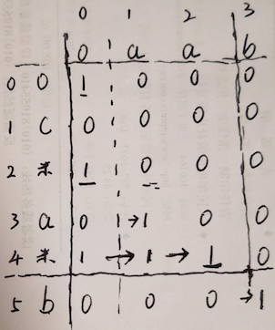

### 10. 正则表达式匹配-H

```
给你一个字符串 s 和一个字符规律 p，请你来实现一个支持 '.' 和 '*' 的正则表达式匹配。

'.' 匹配任意单个字符
'*' 匹配零个或多个前面的那一个元素
所谓匹配，是要涵盖 整个 字符串 s的，而不是部分字符串。

说明:

s 可能为空，且只包含从 a-z 的小写字母。
p 可能为空，且只包含从 a-z 的小写字母，以及字符 . 和 *。
示例 1:

输入:
s = "aa"
p = "a"
输出: false
解释: "a" 无法匹配 "aa" 整个字符串。
示例 2:

输入:
s = "aa"
p = "a*"
输出: true
解释: 因为 '*' 代表可以匹配零个或多个前面的那一个元素, 在这里前面的元素就是 'a'。因此，字符串 "aa" 可被视为 'a' 重复了一次。
示例 3:

输入:
s = "ab"
p = ".*"
输出: true
解释: ".*" 表示可匹配零个或多个（'*'）任意字符（'.'）。
示例 4:

输入:
s = "aab"
p = "c*a*b"
输出: true
解释: 因为 '*' 表示零个或多个，这里 'c' 为 0 个, 'a' 被重复一次。因此可以匹配字符串 "aab"。
示例 5:

输入:
s = "P"
p = "mis*is*p*."
输出: false

```

**注意字符串dp的套路**：  
1. 字符串dp，行列各要加入一个，主要是用来表示空串；
2. 字符串{0,..j}匹配{0,..,i},那接下来看(i+1,j+1)位置，dp也是二维的；
3. 迭代前，把0行或0列的启动位置设置好，然后进入两层循环迭代。


分析： 这个题情况太多了，想清楚很不容易。

1. 首先是匹配的一般字母和‘.'，就要处理两次，重复控制字符'\*'则要看上一个字符，这里上一个字符是个字母（a\*.\*这种形式的，不会出现单独\*,或者\*ab）,处理‘\*’比较复杂；
2. 还有就是怎么判断匹配进度，这里用dp[i][j]==1表示p{0,i-1}匹配s{0,j-1},p[i]和s[j]判断前要先看dp[i][j]是否为1，若不是1则说明s{0,j-1}不匹配p{0,i-1}后续也就没法更新，直接跳过即可；
3. 比较头疼的是，'ab\*c'这种情况的判断，首先重复个数为0，也就是这时p='a'匹配s,这是已经判断过的，dp[i-2][j-1]是确定了的，在重复个数为0时，p[i][j-1]的值等于p[i-2][j-1]的值，并且c的启动判断条件在重复个数为0时，是要看a是否匹配的，即启动条件是dp[i-2][j-1]==1,为了方便操作，这时我们看b位置的dp[i-1][j-1]即可；接下来重复检查的启动条件，就看dp[i][j-1]是否为1，因为这时都是重复字符b，检查和s[j]相等，则更新dp[i][j];

看个例子：   


先初始化第0列，这表示p匹配空串的情况，dp[0][0]=1,空串匹配空串；接下来看p不会空，因为\*不会单独出现，\*之前会有个可用来匹配的字符(字母或'.'),并且\*之前的字符是一定不匹配空串的dp值为0,那\*位置的dp值，往前看两个，比如dp[2][0]=dp[2-2][0],这时表示重复个数为0，p串长度变短，匹配空串，就是将p串变成空。     

再看dp[1][1]，dp[0][0]==1表示p{0,...,0}匹配s{0,..,0},接下来就看p_c和s_a是否匹配，这里不匹配设置为0，这一行只要有一个不匹配，那结下来的都不会匹配；   
看dp[2][1],p_\*重复上一个元素p_c，不匹配s_a，所以dp_\*_a=0;    
 
看dp[3][1],dp[2][0]==1,表示{0,..,0}匹配{0,..,0}，所以接下来看dp[3][1]位置的元素比较，p_a匹配s_a,所以设置dp[3][1]=1;接着看dp[3][2],但dp[2][1]==0,表示{0,..,2}不匹配{0,..,1}，所以加上(3,2)位置，{0,..,3}一定不匹配{0,..,2},所以是0，后续也都是0；    

再看dp[4][1],p_\*表示重复上一个元素p_a，(4,1)要看（3,1)的匹配，所以设置dp[4][1]=1,结下来是重复a,但是第3行只有一个a，所以无法直接用上一行，但是我们已经复制下来dp[4][1],所以重复部分，我们只需看本行前一个是否为1即可，dp[4][2]看dp[4][1]，dp[4][1]==1，表示{0,..,4}匹配{0,..,1}，因为重复接下来看(4,2),(4,2)匹配，所以dp[4][2]=1;接着(4,3)不匹配；    

最后,p_b只满足{0,..,4}匹配{0,..,2},所以只能看(5,3)是否匹配，结果匹配，所以dp[5][3]=1;
dp[5][3]==1,表示{0,..,5}匹配{0,..,3}即p匹配s；

所以最后结果看dp[len(p)][len(s)]是否为1即可。    

---
版本2，代码比较简洁，是经过加工和清理多余操作后的状态，但是没有之前的好理解

    执行结果：通过 执行用时: 4 ms , 在所有 Go 提交中击败了88.59%的用户   
    内存消耗: 2.9 MB, 在所有 Go 提交中击败了9.26%的用户
```go
package main
import "fmt"
func isMatch(s string, p string) bool {
	dp:=make([][]int,len(p)+1)
	for i:=0;i<=len(p);i++{
		dp[i]=make([]int,len(s)+1)
	}
	dp[0][0]=1 //空串匹配空串
	//更新0列，表示p匹配空串的状态
	for i:=2;i<=len(p);i++{
		//合法规则时a*b*,所以只需看*之前第二个，最为继续判断的依据
		if p[i-1]=='*'&&dp[i-2][0]==1{
			dp[i][0]=1
		}
	}
	for i:=0;i<len(p);i++{
		for j:=0;j<len(s);j++{
			if dp[i][j]==1&&(p[i]==s[j]||p[i]=='.'){
				dp[i+1][j+1]=1
			}else if p[i]=='*'{//*需要主动向后扫描
				//dp[i-1][j+1]==1,表示{0,..,i-2}能够表示{0,..,j},用于*重复之前元素0个
				//dp[i+1][j]==1,经过j-1时的更新，表示p{0,i}能够匹配s{0,j-1},所以接着看p{0.i}能否匹配s{0,j}
				//注意dp含有0位置，表示空串
				if dp[i-1][j+1]==1||(dp[i+1][j]==1&&(p[i-1]==s[j]||p[i-1]=='.')){
					dp[i+1][j+1]=1
				}
			}
		}
	}
	return dp[len(p)][len(s)]==1
}
func main() {
	fmt.Println(isMatch("aaaa","ab*a*c*a"))//true
	fmt.Println(isMatch("aaa", "ab*ac*a")) //true
	fmt.Println(isMatch("aaa", "aaaa"))  //false
	fmt.Println(isMatch("ab",".*c"))  //false
	fmt.Println(isMatch("aaa","ab*a"))  //false
	fmt.Println(isMatch("mississippi","mis*is*p*.")) //false
	fmt.Println(isMatch("mississppi","mis*is*p*.")) //true
	fmt.Println(isMatch("aab","c*a*b")) //true
	fmt.Println(isMatch("ab",".*c"))  //false
	fmt.Println(isMatch("aaa","ab*a"))  //false
	fmt.Println(isMatch("",".*"))  //true
	fmt.Println(isMatch("ab",".*"))  //true
}
```

版本1，最开始通过的代码，有较多重复和无用的判断,但是比较容易理解
```go
func isMatch(s string, p string) bool {
	dp:=make([][]int,len(p)+1)
	for i:=0;i<=len(p);i++{
		dp[i]=make([]int,len(s)+1)
	}
	dp[0][0]=1
	for i:=2;i<=len(p);i++{
		if p[i-1]=='*'&&dp[i-2][0]==1{
			dp[i][0]=1
		}
	}
	for i:=0;i<len(p);i++{
		for j:=0;j<len(s);j++{
			if dp[i][j]==1&&(p[i]==s[j]||p[i]=='.'){
				dp[i+1][j+1]=1
			}else if p[i]=='*'{
				if dp[i-1][j+1]==1 {
					dp[i+1][j+1]=1
				}
				if dp[i-1][j]==1{
				    for k:=j;k<len(s)&&i>0&&(p[i-1]==s[k]||p[i-1]=='.');k++{
					    dp[i+1][k+1]=1
			    	}
				}
			}
		}
	}
	return dp[len(p)][len(s)]==1
}
```

