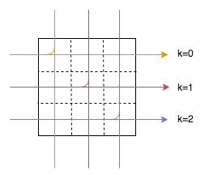

### 764. 最大加号标志-M

label: 能算dp吗？


在一个大小在 (0, 0) 到 (N-1, N-1) 的2D网格 grid 中，除了在 mines 中给出的单元为 0，其他每个单元都是 1。网格中包含 1 的最大的轴对齐加号标志是多少阶？返回加号标志的阶数。如果未找到加号标志，则返回 0。

一个 k" 阶由 1 组成的“轴对称”加号标志具有中心网格  grid[x][y] = 1 ，以及4个从中心向上、向下、向左、向右延伸，长度为 k-1，由 1 组成的臂。下面给出 k" 阶“轴对称”加号标志的示例。注意，只有加号标志的所有网格要求为 1，别的网格可能为 0 也可能为 1。

 

k 阶轴对称加号标志示例:

阶 1:
```
000
010
000
```

阶 2:
```
00000
00100
01110
00100
00000
```

阶 3:
```
0000000
0001000
0001000
0111110
0001000
0001000
0000000
```
 

示例 1：

输入: N = 5, mines = [[4, 2]]   
输出: 2   
解释:   

```
11111
11111
11111
11111
11011
```

在上面的网格中，最大加号标志的阶只能是2。一个标志已在图中标出。  
 

示例 2：

输入: N = 2, mines = []   
输出: 1   

解释:   

11   
11  

没有 2 阶加号标志，有 1 阶加号标志。
 

示例 3：

输入: N = 1, mines = [[0, 0]]   
输出: 0   
解释:   

0

没有加号标志，返回 0 。
 

提示：

整数N 的范围： [1, 500].  
mines 的最大长度为 5000.  
mines[i] 是长度为2的由2个 [0, N-1] 中的数组成.   
(另外,使用 C, C++, 或者 C# 编程将以稍小的时间限制进行​​判断.)   


分析：   
1. 这道题我没怎么看出来dp，我就用最笨的办法做了，dp记录从左边最近的0到当前位置的距离和从上边最近的0到当前位置的距离，后边计算需要虚幻遍历右边和下边宽度，最后四个取最小的长度，加上中心的1,求得阶数。

2. 当时想，累计left和up过来的数字,分别用a,b记录，去最小w=min(dp[i][j].a,dp[i][j].b),这样只需对right和down在[i,min(i+w)],[j,min(N,j+w)] 确定dp[i][j].a=i+k和dp[i][j].b=i+k,(0< k < w),当然这种有所提升

3. 这是看到别人的骚操作，一开始看不明白，后来，太强了，一次扫描就把所有的阶数确定了；首先因为是正方形，所以行列长度相等，可以同时对一行一列进行了连续1长度的更新，又因为是用较小的那个，所以grid初始化为N,之后连续1的长度小于N，就会被更新；此外，对于dp[i][j],在行上，有左右两个方向，所以比较两次（to right,to left)，同样列也是;还有一点，在一个边长度的时间下就计算了一个行和一个列上的阶数，正方形，只要这样计算N次(k from 0 到 N-1)就全部计算完成，所以总的时间复杂度O(N^ 2)。


```go
package main
import "fmt"

/*
执行用时 :1820 ms, 在所有 Go 提交中击败了12.50%的用户
内存消耗 :7 MB, 在所有 Go 提交中击败了100.00%的用户
*/
func orderOfLargestPlusSign_baoli2(N int, mines [][]int) int {
	grid:=make([][]int,N)
	for i:=0;i<N;i++{
		grid[i]=make([]int,N)
	}

	for i:=0;i<len(mines);i++{
		grid[mines[i][0]][mines[i][1]]=-1
	}
	for i:=0;i<N;i++{
		for j:=0;j<N;j++{
			grid[i][j]+=1
		}
	}
	ret:=0
	for i:=0;i<N;i++{
		for j:=0;j<N;j++{
			w,tmp:=0,0
			for k:=j-1;k>=0&&grid[i][k]>0;k--{//l
				if j-k>w{ w=j-k }
			}
			for k:=i-1;k>=0&&grid[k][j]>0;k--{//u
				if i-k>tmp{ tmp=i-k }
			}
			if w>tmp{ w=tmp }
			tmp=0
			for k:=j+1;k<N&&grid[i][k]>0;k++{//r
				if k-j>tmp{ tmp=k-j }
			}
			if w>tmp{ w=tmp }
			tmp=0
			for k:=i+1;k<N&&grid[k][j]>0;k++{//d
				if k-i>tmp{ tmp=k-i }
			}
			if w>tmp{ w=tmp }
			if grid[i][j]>0{ w+=1 }
			if ret<w{ ret=w }
		}
	}
	return ret
}

/*
执行用时 :232 ms, 在所有 Go 提交中击败了37.50%的用户
内存消耗 :10.8 MB, 在所有 Go 提交中击败了100.00%的用户
*/
type Node struct{
	a,b int
}
func orderOfLargestPlusSign_baoli1(N int, mines [][]int) int {
	dp:=make([][]Node,N)
	for i:=0;i<N;i++{
		dp[i]=make([]Node,N)
	}

	for i:=0;i<len(mines);i++{
		dp[mines[i][0]][mines[i][1]].a=-1
		dp[mines[i][0]][mines[i][1]].b=-1
	}
	for i:=0;i<N;i++{
		for j:=0;j<N;j++{
			dp[i][j].a+=1
			dp[i][j].b+=1
			if j>0&&dp[i][j].a>0{
				dp[i][j].a=dp[i][j-1].a+1
			}
			if i>0&&dp[i][j].b>0{
				dp[i][j].b=dp[i-1][j].b+1
			}
		}
	}
	ret:=0
	for i:=0;i<N;i++{
		for j:=0;j<N;j++{
			w:=dp[i][j].a-1
			if w>dp[i][j].b-1{ w=dp[i][j].b-1 }
			k:=j+w
			for ;k>j;k--{
				if k<N&&dp[i][k].a-dp[i][j].a==k-j{ break }
			}
			if w>k-j{ w=k-j } //找到最右符合的位置
			k=i+w
			for ;k>i;k--{
				if k<N&&dp[k][j].b-dp[i][j].b==k-i{ break }
			}
			if w>k-i{ w=k-i }
			if ret<w+1{ ret=w+1 }
		}
	}
	return ret
}


/*
执行用时 :80 ms, 在所有 Go 提交中击败了100.00%的用户
内存消耗 :7 MB, 在所有 Go 提交中击败了100.00%的用户
*/
func orderOfLargestPlusSign(N int, mines [][]int) int {
	grid:=make([][]int,N)
	for i:=0;i<N;i++{
		grid[i]=make([]int,N)
	}
	for i:=0;i<N;i++{
		for j:=0;j<N;j++{
			grid[i][j]=N
		}
	}
	for i:=0;i<len(mines);i++{
		grid[mines[i][0]][mines[i][1]]=0
	}

	left,right,up,down:=0,0,0,0
	for k:=0;k<N;k++{
		left,right,up,down=0,0,0,0
		for i,j:=0,N-1;i<N;i,j=i+1,j-1{
			if grid[i][k]==0{ down=0 }else{ down+=1}
			if down<grid[i][k]{ grid[i][k]=down }
			if grid[k][i]==0{ left=0 }else{ left+=1 }
			if left<grid[k][i]{ grid[k][i]=left }
			if grid[j][k]==0{ up=0 }else{ up+=1 }
			if up<grid[j][k]{ grid[j][k]=up }
			if grid[k][j]==0{ right=0 }else{ right+=1 }
			if right<grid[k][j]{ grid[k][j]=right }
		}
	}
	ret:=0
	for i:=0;i<N;i++{
		for j:=0;j<N;j++{
			if grid[i][j]>ret{ ret=grid[i][j] }
		}
	}
	return ret
}

func main() {
	tables:=[][][]int{
		{{5},{4,2},},
		{{2},},
		{{1},{0,0}},
	}
	for _,v:=range tables{
		fmt.Println(orderOfLargestPlusSign(v[0][0],v[1:]))
	}
	
}

```