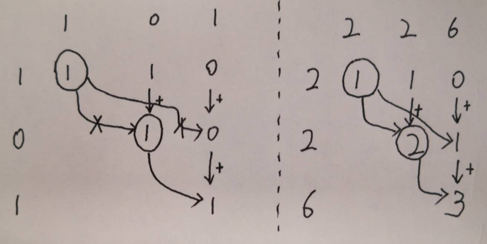

#### 91. 解码方法

一条包含字母 A-Z 的消息通过以下方式进行了编码：

'A' -> 1
'B' -> 2
...
'Z' -> 26
给定一个只包含数字的非空字符串，请计算解码方法的总数。

示例 1:

输入: "12"
输出: 2
解释: 它可以解码为 "AB"（1 2）或者 "L"（12）。
示例 2:

输入: "226"
输出: 3
解释: 它可以解码为 "BZ" (2 26), "VF" (22 6), 或者 "BBF" (2 2 6) 。


分析：动态规划首先是如何构建dp表，也就是如何找到子问题，像这种串的，一般都是横竖自我展开。那分析dp该怎么计算，也就是子问题如何进行。

首先，很容易我们想到s{0:i}如果确定，那接着确定s{i:i+1},s{i:i+2}...,所以子问题确定了;   
那具体的dp计算呢，dp[i][j]表示其s{i:j}的解码方法的个数，一般我们先把初始行列求出来，方便后续的迭代，这里不会用到列，所以只对第一行进行了初始计算；

dp迭代，是很有意思的，也是最不容易确定的，但只要我们能够确定dp[i][j]的准确意义，那就好办了，在每一行的遍历中dp[i][j->n]表示s{i:j}的解码次数，我们需要将各个部分的解码总数加起来；  

e.g.:   
1. 以“226”为例子，初始化第一行为1,1,0表示2，22能够解码解且有一种解码方法，226不能解码；   
2. 计算dp[1][1]，因为2能够被解码，又dp[0][0]>0表示，2之前的那一部分可被解码，并且解码数为dp[0][0],所以合起来，22能够被解码，因为dp[1][1]时，{2}是单元素，只有一种情况，所以组合起来的解码总数就和2之前的解码总数一致dp[0][0];第一行dp[0][1]>0,表示22能够被解码，这又是一种解码方案，解码数为dp[0][1],所以当前22可被解码的方法总数为dp[0][1]+dp[1][1]，即就是那一类的累加和，为方便计算，我们累加下来，dp[1][1]+=dp[0][1];
3. **计算dp[1][2],表示26能够被解码，那26之前的部分是2,前部分划分总数是dp[0][0]**,所以dp[1][2]=dp[0][0],并将这里列的方法总数累加下来，dp[1][2]+=dp[0][2];   
4. 同样的方法，计算第三行，最后dp[len(s)-1][len(s)-1]即是所有的解码总数。


**所以计算公式**:   
当前能够被解码时（比如226中的2）：
$$
dp[i][j]=dp[i-1][i-1]+dp[i-1][j]
$$
当前不能被解码时(比如101中的0)：
$$
dp[i][j]+=dp[i-1][j]
$$
左边例子101,是在说明题目的要求01是不能够被解码的。




#### code2:通过字符计算转化成数字

还有一点，题目中又测试比较大的case,我这里提交时，没有把测试的fmt.Println()删掉，导致超时，删除后，通过；另外之前用的时strconv.Atoi将字符串转化为数字，改为字符计算转化为数字后，速度又有所提升。   

执行结果：通过   
执行用时 :8 ms, 在所有 Go 提交中击败了23.53%的用户   
内存消耗 :15.7 MB, 在所有 Go 提交中击败了6.25%的用户  
```go
package main
import "fmt"
func numDecodings(s string) int {
	if len(s)==0{
		return 0
	}
	dp:=make([][]int,len(s))
	for i:=0;i<len(s);i++{
		dp[i]=make([]int,len(s))
	}
	tmp:=0
	for i:=0;i<len(s);i++{
		tmp=tmp*10+int(s[i]-'0')
		if tmp<=26&&s[0]!='0'{
			dp[0][i]=1
		}
	}
	for i:=1;i<len(s);i++{
		tmp:=0
		for j:=i;j<len(s);j++{
			tmp=10*tmp+int(s[j]-'0')
			if tmp<=26{
				if s[i]!='0'{
					dp[i][j]+=dp[i-1][i-1]
				}
				dp[i][j]+=dp[i-1][j]
			}
		}
	}
	return dp[len(s)-1][len(s)-1]
}
func main() {
	fmt.Println(numDecodings("6065812287883668764831544958683283296479682877898293612168136334983851946827579555449329483852397155"))
	fmt.Println(numDecodings("227"))
	fmt.Println(numDecodings("1010"))
	fmt.Println(numDecodings("110"))
	fmt.Println(numDecodings("101"))
	fmt.Println(numDecodings("0"))
	fmt.Println(numDecodings("00"))
	fmt.Println(numDecodings("10"))
	fmt.Println(numDecodings("01"))
	fmt.Println(numDecodings(""))
	fmt.Println(numDecodings("12"))
	fmt.Println(numDecodings("226"))
}
```

#### code1:用strconv.Atoi转化字符串

执行结果：通过  
执行用时 :788 ms, 在所有 Go 提交中击败了9.80%的用户   
内存消耗 :79.8 MB, 在所有 Go 提交中击败了6.25%的用户   


```go

func numDecodings(s string) int {
	if len(s)==0{
		return 0
	}
	dp:=make([][]int,len(s))
	for i:=0;i<len(s);i++{
		dp[i]=make([]int,len(s))
	}
	for i:=0;i<len(s);i++{
		tmp,_:=strconv.Atoi(s[0:i+1])
		tmp2,_:=strconv.Atoi(s[1:i+1])

		if tmp<=26&&tmp!=tmp2{
			dp[0][i]=1
		}
	}
	for i:=1;i<len(s);i++{
		for j:=i;j<len(s);j++{
			tmp,_:=strconv.Atoi(s[i:j+1])
			tmp2,_:=strconv.Atoi(s[i+1:j+1])
			if tmp<=26{
				if tmp!=tmp2 {
					dp[i][j]+=dp[i-1][i-1]
				}
			}
			dp[i][j]+=dp[i-1][j]
		}
	}
	return dp[len(s)-1][len(s)-1]
}
```