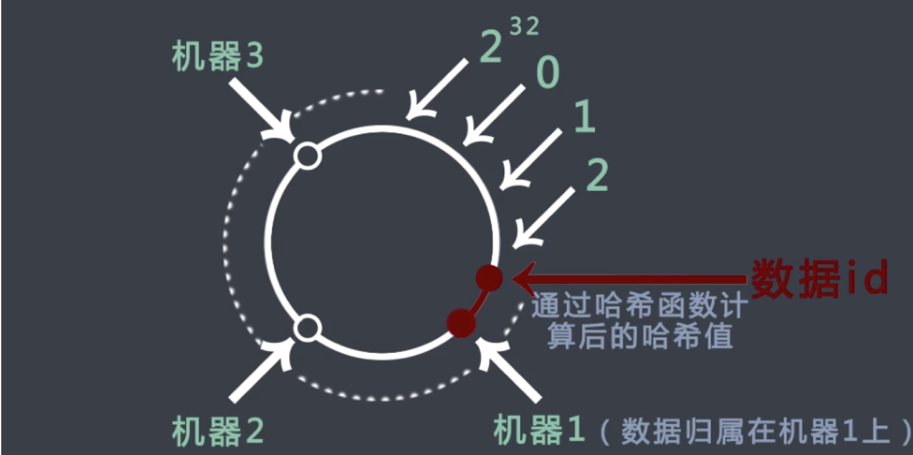
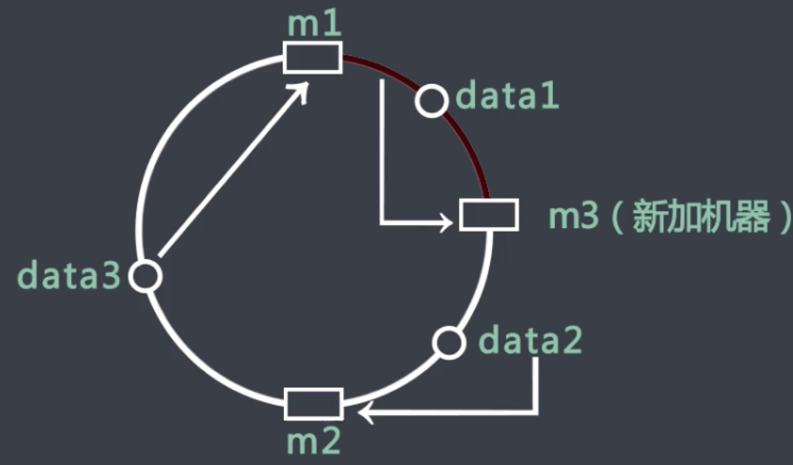

### BAT-大数据
    
    
比较适合面试，不适合笔试

哈希函数（又称散列函数）

性质：
1. 典型的哈希函数都拥有无限的输入值域。
2. 输入值相同，返回值一样。
3. 输入值不同时，返回值可能一样，也可能不一样。
4. 不同输入值得到的哈希值，整体均匀的分布在输出域s上。（重要）

map-reduce
1. map：把大任务分成子任务
2. reduce：子任务并发处理，然后合并结果

注意点：
1. 备份的考虑，分布式存储的设计细节，以及容灾策略
2. 任务分配策略与任务进度跟踪的细节设计，节点状态的呈现
3. 多用户权限的控制

用map-reduce方法统计一篇文章中每个单词出现的个数

预处理： 只包含单词之后的文本
1. 去掉文章中的标点符号
2. 对连字符‘-’的处理
3. 处理缩写的处理
4. 大小写的处理

map阶段：
1. 对每个单词生成词频为1的记录
2. 通过hash函数得到每个单词的哈希值，并根据该值分成若干组任务
reduce:
3. 每一个子任务中包含若干种单词，但同一种单词不会分配进不同的子任务中
4. 单个子任务中同一种单词的词频进行合并，所有记录统一合并
最终实现每种单词的词频统计

常见的海量处理题目解题关键

**案例一：请对10亿个ipv4的ip地址进行排序，每个ip只会出现一次。**

方法，将ipv4转化成整数，对整数进行排序后，再转化成ip。
关于空间：ipv4的ip数量约42亿，可以将ip转化为无符号整数。10亿个整数大约占用4G空间。 
**用bitmap方法**
1. 申请长度为2^32的bit类型的数组bitmap，每个位置上是一个bit,只可表示0或者1两种状态。
2. 将ipv4转化成整数k，对于每个ipv4转化成k并在bitmap上第k个bit修改为1
3. 从头开始访问，依次输出，为1的那个位置对应的ip，这样即可完成所有排序。
bitmap所用空间512MB。

**案例二：请对10亿人的年龄进行排序**
10亿个年龄，其年龄分布在0到200的数组

**案例三：有一个包含20亿个全是32位整数的大文件，在其中找到出现次数最多的数，但是内存限制只有2G。**

2,000,000,000*4B约8GB

hashmap记录所有数出现的次数，key-->具体某一种数，value-->这种数出现的次数。

使用哈希函数进行分流，将大文件分成多个小文件，这里用16个，

同一种数不会被分配到不同文件，这是哈希函数性质决定的。
对于不同的数，每个文件中含有整数的种数机会一样，这也是哈希函数性质决定的。
全部处理完后，得到16个文件中各自的第一名。
再从16个第一名中，再选出其中的第一名。
(处理大数据问题的分流思想）

**案例四：32位无符号整数的范围是0～4294967295。现在有一个正好包含40亿个无符号整数的文件，所以在整个范围中必然有没有出现过的数，可以使用最多10M的内存，只用找到一个没出现过的数即可，该如何查找？**

hashtable:20亿个32位整数的大文件，如果用哈希表来记录所有的数，最差情况下，将出现40亿个不同的数，每一条记录占有4字节，大约需要16G内存。

bitmap:申请2^32bits大小的空间，每个位置1bit,只能表示0或1两种状态。大约占用500m空间。

分流方式：将0-2^32-1划分成64个区间，单个区间应该装下2^32/64个数，总共的范围为42亿，但数一共为40亿，所以必然会有区间计数不足2^32/64=2^26约8MB。就是遍历文件，填充空间，最后找是否有没出现的，若有，则可停止。

总结：
1. 根据内存限制决定区间大小，根据区间大小，得到有多少个变量，来记录每个区间的数出现的次数。
2. 统计区间上的数的出现次数，找到不足的区间。
3. 利用bitmap对不满的区间，进行这个区间上的数的词频统计。

**案例五：某搜索公司一天的用户搜索词汇是海量的，假设有百亿的数据量，请设计一种求出每天最热100词的可行办法**

哈希分流思想：将百亿数量级的搜索词汇分流到n个机器上,若分流到机器上，仍处理不了，则可以拆成更小的文件进行处理；处理每个可以处理的小文件，得到每个小文件中词汇的词频统计，用hash建立记录后，利用小根堆来进行TOP100的筛选；接下来可以利用外排序得到机器上的top100或者继续利用小根堆就可以得到top100,这样得到一个机器上的top100；最后不同机器上也进行类似操作，得到top100。

topk的问题，除了用hash函数分流和用hash表做词频统计之外，还可能用到堆结构和外排序等手段。

**案例六：工程师常使用服务器集群来设计和实现数据缓存，以下是常见的策略。1，无论是添加、查询还是删除数据，都先将数据的id通过哈希函数转成一个哈希值，记为key。2,如果目前机器有N台，则计算key%N的值，这个值就是该数据所属的机器编号，无论是添加删除还是查询操作，都只在这台机器上进行。请分析这种缓存策略可能带来的问题，并提出改进方案。**
潜在问题：如果增加或者删除机器，数据迁移的代价很大。N发生变化，所有的数据都不得不对所有的数据重新计算一遍hash,因为对%N这个操作已经失效了。需要对新的机器数M取余，来决定各自数据的归属。

一致性哈希算法-一种很好的数据缓存方案：
假设数据id通过哈希计算后的结果为0～2^32,将这些数字首位相连，想像成闭合的环形，则id的哈希值可以对应到换上的一个位置；
假设有三台机器，根据机器id计算hash，决定在环上的位置；
数据id计算hash得到换上位置，然后顺时针，查找机器，最先找到的机器就是其归属。
添加机器a，假设位于机器1和机器2之间，那么1-a这部分数据要属于机器a，同时只需迁移机器2上在1-a之间的数据即可；
删除机器a，假设位于机器1和机器2之间，只需要将机器a的数据迁移到机器2上即可。

