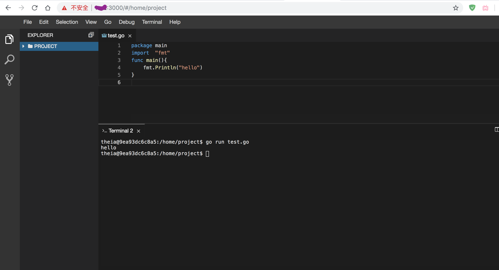
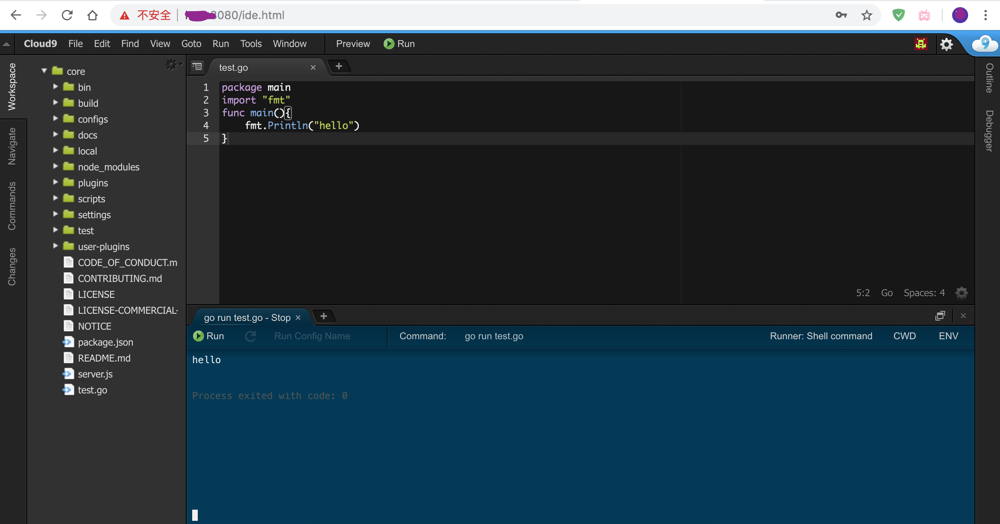
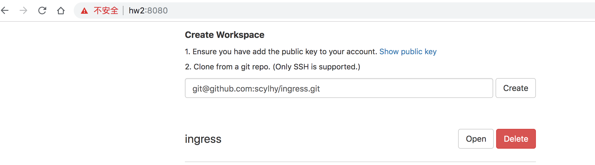
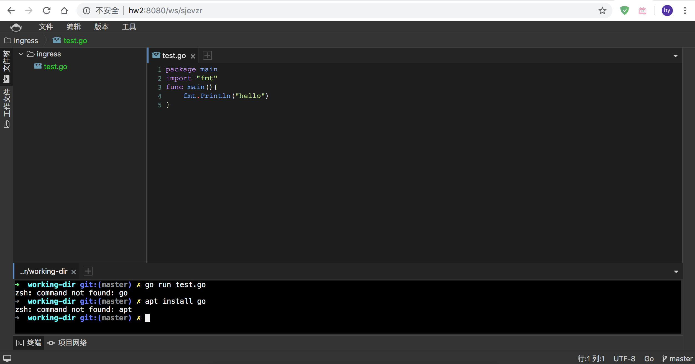
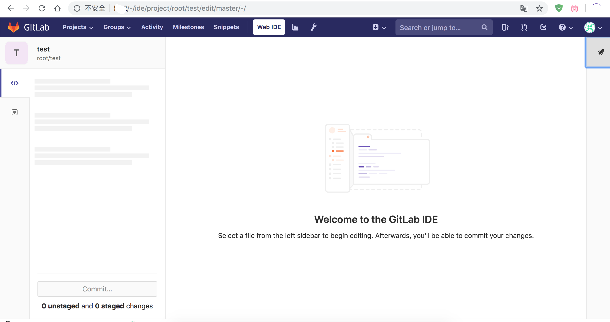

#### web ide

在做项目中，遇到一个这样的场景，当我们把系统服务搭建好，给用户显示的时候，如果用命令行一步步的走，感觉会把他们弄晕，另外，交付系统，还得一步步的写操作流程，遇到一点问题，就还得补充进去，所以我就想，能不能搭建一个web-ide,用户直接把代码复制上去，点点点，就能完成系统的完整体验。

当然，还有就是Web-ide对于移动办公、合作开发也有帮助，比如我想把我的代码给别人看，直接在他电脑上打开web-ide就好。

嗯，还有第三点，最近在搞函数计算，需要自己搭建一个函数计算服务，可以直接在网页上编写函数，然后代码推送到函数服务中去，测试函数，但是官方的web-ide就是一个框，效果不好，就在想能否搭建一个web-ide，并做适当调整修改，关联到函数计算服务上。


我通过google,查到几款开源的web-ide，依次进行了部署测试。

#### [theia-ide/theia-apps](https://github.com/theia-ide/theia-apps#theia-docker)

这一款ide跟vscode基本功能一毛一样，部署简单，直接通过封装好的容器部署即可，我这里测试go版本的镜像，如果需要其他语言，选择其他镜像即可，这款ide整体感觉不错，还有debug哈。**推荐**。
```bash
docker run -it -p 3000:3000 -v "$(pwd):/home/project:cached" theiaide/theia:next
```


#### [cloud9](https://github.com/c9/core)

这款就比较出名了，AWS推出的web-ide，功能强大，代码稳定，项目是通过node js写的，这是我唯一感到的障碍，我不太了解js，如果对它进行改动，可能要麻烦。**稳定可用，推荐**。

安装比较简单，直接执行安装脚本，启动服务即可。
```
git pull origin master
scripts/install-sdk.sh
apt install nodejs
node server.js
```




#### [Coding/WebIDE](https://github.com/Coding/WebIDE)

这是国内一款web-ide，项目已经迁移到腾讯云下，这里仍旧测试原来的web-ide，该ide适合git版本仓库搭配使用的，使用前，需要深入你的git仓库地址，之后开发你的项目。新版本未尝试，旧版本就不推荐了。

直接```./ide.sh run     # start the backend server```运行。




#### [GitLab](https://docs.gitlab.com/ee/user/project/web_ide/)

gitLab这个代码仓库，本身就支持web-ide,但这个web-ide是整个代码仓库的服务的一部分，如果需要再自己服务上，可能要[搭建gitLab](https://juejin.im/post/5a4c9ff36fb9a04507700fcc#heading-11)，并且改动的可能性比较小，如果需要完整的代码管理的顺便可带上web-ide,若单独需要一个web-ide,甚至需要改动，那就不推荐了。

大体是下图这样，我这测试没打开项目代码～～，没有使用这个web ide。


参考：  

1. [theia-ide/theia-apps](https://github.com/theia-ide/theia-apps#theia-docker)
2. [cloud9](https://github.com/c9/core)
3. [Coding/WebIDE](https://github.com/Coding/WebIDE)
4. [gitlab](https://docs.gitlab.com/ee/user/project/web_ide/)
5. [通过 docker 搭建自用的 gitlab 服务](https://juejin.im/post/5a4c9ff36fb9a04507700fcc#heading-11)