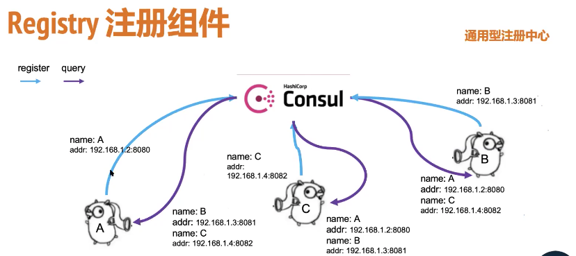
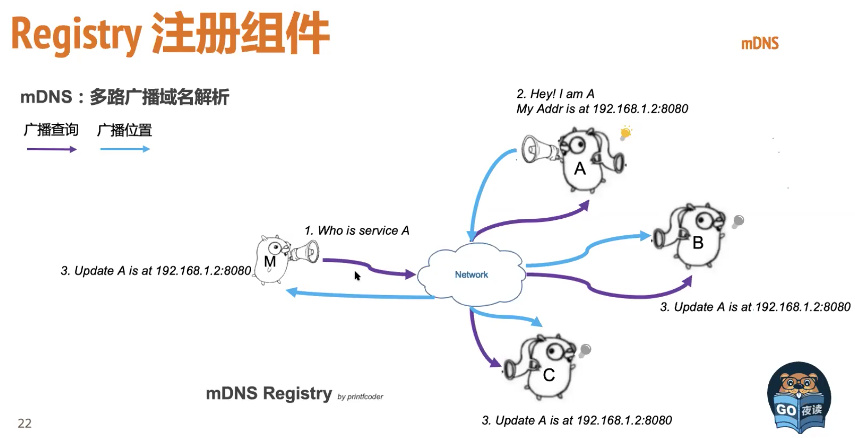

### go-micro微服务框架设计  

框架与工具集：Go-Micro(库)、Micor(运行时工具集)   

注册组件(整理):mDNS、Consul、ZK、NATs、ETCD、Eureka、k8s 

**几种注册中心的实现**

1. 基于通用型注册中心，ETCD、Consul、ZK、Eureka  
2. 基于网络广播，如mDNS、Gossip   
3. 基于消息中间件，如NATs   

Registry注册组件   

一般的服务注册中心

mDNS：多路广播域名解析 基于广播的域名解析   

M查A服务，通过广播查询对应地址，A收到请求，广播应答消息，其他机器收到后更新本地记录。类似RIP在局域网上查找MAC过程。   

基于NATs消息系统Pub/Sub注册   

A服务订阅一个query主题，B想NATs发送/广播一条消息，期望服务A地址，将结果响应到B，A收到后将消息发送到B  

